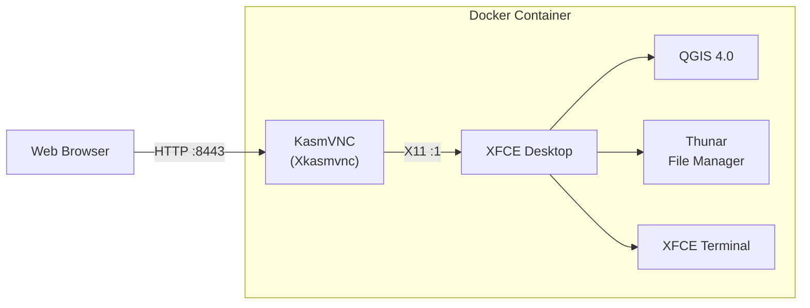

# QGIS Desktop Docker

A fully reproducible, Nix-built Docker image that runs [QGIS](https://qgis.org) inside a minimal XFCE desktop, accessible from any web browser via [KasmVNC](https://kasmweb.com). No VNC client needed -- just open a URL.


## Features

- **Browser-based access** -- connect to a full QGIS desktop from any device with a web browser
- **Multi-monitor support** -- KasmVNC supports dynamic resolution resizing and multiple monitors
- **Fully reproducible** -- the entire image is defined declaratively in a Nix flake
- **Persistent workspaces** -- mount a volume to keep your QGIS projects, plugins, and settings across restarts
- **Minimal footprint** -- only the packages needed to run QGIS and the desktop environment
- **SBOM & CVE scanning** -- every build produces a Software Bill of Materials and vulnerability scan

## Quick Start

### Pull from GHCR

> **Note:** If the package is private, authenticate first: `echo $GITHUB_TOKEN | docker login ghcr.io -u USERNAME --password-stdin`

```bash
docker pull ghcr.io/kartoza/qgis-desktop-docker:latest
docker run --rm -p 8443:8443 ghcr.io/kartoza/qgis-desktop-docker:latest
```

Open [http://localhost:8443](http://localhost:8443) in your browser.

### Using Docker Compose

```bash
curl -O https://raw.githubusercontent.com/kartoza/qgis-desktop-docker/main/docker-compose.yml
docker compose up -d
```

## Usage Examples

### Basic (ephemeral)

```bash
docker run --rm -p 8443:8443 ghcr.io/kartoza/qgis-desktop-docker:latest
```

### Persistent home directory (named volume)

```bash
docker run --rm -p 8443:8443 \
  -v qgis-home:/home/user \
  ghcr.io/kartoza/qgis-desktop-docker:latest
```

QGIS settings, plugins, and projects in `/home/user` survive container restarts.

### Bind mount a local directory

```bash
docker run --rm -p 8443:8443 \
  -v "$HOME/qgis-data:/home/user/data" \
  ghcr.io/kartoza/qgis-desktop-docker:latest
```

### Persistent home + local data

```bash
docker run --rm -p 8443:8443 \
  -v qgis-home:/home/user \
  -v "$HOME/gis-projects:/home/user/projects" \
  ghcr.io/kartoza/qgis-desktop-docker:latest
```

### Custom resolution

```bash
docker run --rm -p 8443:8443 \
  -e VNC_RESOLUTION=1920x1080 \
  ghcr.io/kartoza/qgis-desktop-docker:latest
```

### Custom port

```bash
docker run --rm -p 3000:3000 \
  -e VNC_PORT=3000 \
  ghcr.io/kartoza/qgis-desktop-docker:latest
```

## Docker Compose

```yaml
services:
  qgis-desktop:
    image: ghcr.io/kartoza/qgis-desktop-docker:latest
    ports:
      - "8443:8443"
    environment:
      - VNC_RESOLUTION=1920x1080
    volumes:
      - qgis-home:/home/user
      # Optional: mount a local data directory
      # - ./data:/home/user/data
    restart: unless-stopped

volumes:
  qgis-home:
```

## Environment Variables

| Variable | Default | Description |
|----------|---------|-------------|
| `VNC_PORT` | `8443` | Port for the KasmVNC web interface |
| `VNC_RESOLUTION` | `1280x720` | Initial desktop resolution (resizable in browser) |
| `VNC_COL_DEPTH` | `24` | Color depth (16, 24, or 32) |
| `VNC_PW` | `password` | VNC password (basic auth is disabled by default) |
| `DISPLAY` | `:1` | X display number |

## Kasm permission controls

The container ships with KasmVNC's data-loss-prevention knobs wired to environment
variables. Defaults are **restrictive** — clipboard sharing is disabled in both
directions until you explicitly enable it. Boolean values accept
`1`, `yes`, `true`, `on`, or `enabled`; anything else counts as off.

| Variable | Default | Xkasmvnc flag | Effect |
|----------|---------|---------------|--------|
| `KASM_ALLOW_CLIPBOARD_IN` | `0` | `-AcceptCutText` | Allow pasting from local machine into the container |
| `KASM_ALLOW_CLIPBOARD_OUT` | `0` | `-SendCutText` | Allow copying from the container out to the local machine |
| `KASM_ALLOW_PRIMARY_SELECTION` | `0` | `-SendPrimary` | Share X primary selection (middle-click paste) |
| `KASM_CLIPBOARD_IN_MAX` | `0` | `-DLP_ClipAcceptMax` | Max bytes accepted per paste; `0` = unlimited |
| `KASM_CLIPBOARD_OUT_MAX` | `0` | `-DLP_ClipSendMax` | Max bytes sent per copy; `0` = unlimited |
| `KASM_CLIPBOARD_DELAY_MS` | `0` | `-DLP_ClipDelay` | Minimum ms between clipboard operations (anti-spam) |
| `KASM_CLIPBOARD_MIME_TYPES` | *(kasm default)* | `-DLP_ClipTypes` | Comma-separated MIME allowlist, e.g. `text/plain,text/html` |
| `KASM_WATERMARK_TEXT` | *(none)* | `-DLP_WatermarkText` | Overlay text on the desktop as a screenshot deterrent. `${USER}` / `$USER` is expanded by `start-desktop.sh` to the first `KASM_USERS` entry (or `VNC_USER`). strftime tokens (`%H:%M` etc.) are expanded by KasmVNC at render time. Stick to ASCII — the default watermark font lacks glyphs like em dash (U+2014). |
| `KASM_DLP_LOG` | `off` | `-DLP_Log` | `off`, `info`, or `verbose`. **`verbose` logs KEYSTROKES AND CLIPBOARD CONTENT to the server log** |

### Examples

Block copy/paste both directions, watermark the desktop:

```bash
docker run --rm -p 8443:8443 \
  -e KASM_WATERMARK_TEXT='${USER} %H:%M' \
  ghcr.io/kartoza/qgis-desktop-docker:latest
```

Allow paste in but block copy out (a common data-exfil control), with a 4 KB cap:

```bash
docker run --rm -p 8443:8443 \
  -e KASM_ALLOW_CLIPBOARD_IN=1 \
  -e KASM_CLIPBOARD_IN_MAX=4096 \
  -e KASM_CLIPBOARD_MIME_TYPES=text/plain \
  ghcr.io/kartoza/qgis-desktop-docker:latest
```

Fully permissive (matches the KasmVNC upstream default posture):

```bash
docker run --rm -p 8443:8443 \
  -e KASM_ALLOW_CLIPBOARD_IN=1 \
  -e KASM_ALLOW_CLIPBOARD_OUT=1 \
  -e KASM_ALLOW_PRIMARY_SELECTION=1 \
  ghcr.io/kartoza/qgis-desktop-docker:latest
```

### File transfer

KasmVNC 1.4.0 **standalone** does not expose a runtime toggle for the file
upload/download feature — that lives in the (commercial) Kasm Workspaces
platform. If you need to block file transfer, put the container behind a
reverse proxy and drop the upload/download endpoints there, or drop the
container's outbound network with `--network none`.

## Egress network lockdown

The container ships with an **egress firewall enabled by default**. On startup
a root entrypoint installs nftables rules that allow only:

- loopback traffic,
- return traffic for connections the container initiated (`ct state established,related`),
- DNS to Docker's embedded resolver (`127.0.0.11`) and any nameserver in `/etc/resolv.conf`,
- the hosts you name in `KASM_EGRESS_ALLOW`.

Everything else outbound is dropped. Once the rules are installed, the
entrypoint drops all inheritable/ambient capabilities and switches to UID
1000, so the desktop process can neither modify nor observe the firewall.

| Variable | Default | Description |
|----------|---------|-------------|
| `KASM_EGRESS_LOCKDOWN` | `1` | `0` disables the filter entirely (**dev only**) |
| `KASM_EGRESS_ALLOW` | *(empty)* | Comma-separated allowlist: IPv4 addresses, CIDRs, and/or hostnames (resolved once at startup) |

### Required capability

The container needs `NET_ADMIN` so the entrypoint can call `nft`. Add it on
`docker run` or in compose:

```bash
docker run --cap-add=NET_ADMIN -p 8443:8443 ...
```

```yaml
services:
  qgis-desktop:
    cap_add:
      - NET_ADMIN
```

If `NET_ADMIN` is missing and `KASM_EGRESS_LOCKDOWN=1` (the default) the
container **fails closed** — it prints a diagnostic and exits. Set
`KASM_EGRESS_LOCKDOWN=0` to opt out.

### Example: only the postgres database reachable

```bash
docker run --rm -p 8443:8443 --cap-add=NET_ADMIN \
  -e KASM_EGRESS_ALLOW='db.internal,10.0.0.0/24' \
  ghcr.io/kartoza/qgis-desktop-docker:latest
```

Inside the desktop, `psql -h db.internal ...` works; `curl https://example.com`
hangs and times out.

### Caveats

- Hostnames are resolved **once** at container start. If the target's IP
  changes (typical for cloud-managed databases), restart the container.
- Only IPv4 is filtered by default. If you use IPv6, add rules to
  `entrypoint.sh` or block IPv6 with `--sysctl net.ipv6.conf.all.disable_ipv6=1`.
- The filter runs inside the container's network namespace, so it does not
  restrict traffic between multiple containers on a shared Docker network
  unless each container has its own filter.

## Endpoints

| URL | Description |
|-----|-------------|
| `http://localhost:8443` | KasmVNC web client (full desktop) |

## Scenarios

Worked-example deployments combining several of the knobs above:

- **[Analyst locked-down session](docs/scenarios/analyst-locked-down.md)** —
  single user `bob`, clipboard blocked in both directions, egress restricted
  to a co-located `kartoza/postgis` container. Includes UML diagrams and a
  ready-to-run `docker-compose.yml`. Try it with `nix run .#run-analyst-scenario`.

## Architecture



The container runs a single process tree:

1. **`start-desktop.sh`** -- entrypoint that orchestrates startup
2. **`Xkasmvnc`** -- X server + VNC + embedded web server (KasmVNC)
3. **`dbus-run-session`** -- manages the D-Bus session bus
4. **`startxfce4`** -- launches XFCE window manager, panel, desktop
5. **QGIS** -- available in the applications menu and panel launcher

KasmVNC is driven directly (the `Xkasmvnc` binary) rather than through the `kasmvncserver` Perl wrapper, eliminating a large Perl dependency tree.

## Building from Source

### Prerequisites

- [Nix](https://nixos.org/download) with flakes enabled
- Docker

### Using Nix

```bash
git clone https://github.com/kartoza/qgis-desktop-docker.git
cd qgis-desktop-docker

# Build and load the Docker image
nix run .#build-docker

# Or step by step
nix build .#docker
nix store cat $(nix build .#docker --print-out-paths) | docker load

# Run
docker run --rm -p 8443:8443 nix-xfce-kasm:latest
```

### Using Make

```bash
make build-docker    # Build the image
make run             # Run in foreground
make run-detached    # Run in background
make run-persistent  # Run with persistent home volume
make stop            # Stop the container
make summary         # Generate build summary
make compose-up      # Start with docker-compose
make compose-down    # Stop docker-compose
```

### Available `nix run` commands

```bash
nix run .#build-docker  # Build the Docker image
nix run .#run           # Run the container
nix run .#summary       # Generate build summary
nix run                 # Show help
```

### Development shell

```bash
nix develop
```

Provides docker, python3, syft, grype, jq, and other tools.

## Project Structure

```
flake.nix                    # Main flake: packages, Docker image, apps, dev shell
kasmvnc.nix                  # KasmVNC package (v1.4.0 from Debian Bookworm deb)
libcrypt-compat.nix          # libcrypt.so.1 compat lib from Debian
start-desktop.sh             # Entrypoint: launches Xkasmvnc + XFCE
config/                      # XFCE panel and desktop configuration
docker-compose.yml           # Docker Compose example
Makefile                     # Make targets for build/run/summary
build-summary.sh             # Build summary generator
scripts/
  sbom_table.py              # SBOM JSON to markdown table
  cve_table.py               # Grype CVE JSON to markdown table
.github/workflows/
  docker.yml                 # Unified PR + Release workflow
```

## CI/CD

A single GitHub Actions workflow (`.github/workflows/docker.yml`) handles both PRs and releases.

### On every Pull Request

1. Builds the Docker image with Nix
2. Generates an SBOM (SPDX JSON via anchore/sbom-action)
3. Scans for CVEs (Grype via anchore/scan-action)
4. Generates a build report with image stats, SBOM table, and CVE table
5. Uploads image tarball, SBOM, and CVE scan as **7-day artifacts**
6. Posts/updates a **PR comment** with the full build report

### On every Release

1. Builds the Docker image with Nix
2. Generates SBOM and CVE scan
3. Pushes to **GitHub Container Registry** (`ghcr.io/kartoza/qgis-desktop-docker`)
4. Tags with both version and `latest`
5. Appends build report to release notes
6. Attaches image tarball, `sbom.spdx.json`, and `cve-scan.json` as release assets

## Security & Transparency

Every build generates:

- **[SBOM](https://github.com/kartoza/qgis-desktop-docker/releases/latest)** (`sbom.spdx.json`) -- complete Software Bill of Materials in SPDX JSON format listing every package in the image
- **[CVE Scan](https://github.com/kartoza/qgis-desktop-docker/releases/latest)** (`cve-scan.json`) -- Grype vulnerability scan results with severity ratings

Both are attached to every release and available as artifacts on every PR build.

### Authentication

The container offers three auth pathways selected by `KASM_AUTH_MODE`
(default: `basic`):

| Mode | What the user sees | When to use |
|------|--------------------|-------------|
| `basic` | Browser's HTTP Basic Auth dialog | Fast to set up. Fine for a single trusted user. |
| `greeter` | In-desktop LightDM login form | Multi-user, or wherever users may need to log out / re-authenticate without closing the browser tab. |
| `none` | No prompt — desktop appears immediately | Local dev only. Never expose to any untrusted network. |

Legacy `KASM_AUTH=0` still forces `none` for backwards compatibility.

All three modes read credentials from the same sources (first wins):

1. `KASM_USERS_FILE` — path to a file containing `user:password` per line;
   default `/etc/kasmvnc/users`. `#` comments and blank lines ignored.
   Mount with mode `0600`.
2. `KASM_USERS` — inline `alice:pw1,bob:pw2` list.
3. Legacy `VNC_USER` / `VNC_PW` — single user, defaults to `user` / `password`.

| Variable | Default | Description |
|----------|---------|-------------|
| `KASM_AUTH_MODE` | `basic` | `none` \| `basic` \| `greeter` |
| `KASM_AUTH` | *(unset)* | Legacy: `0` forces `none`. |
| `KASM_USERS_FILE` | `/etc/kasmvnc/users` | Bind-mount target for a `user:password` file |
| `KASM_USERS` | *(none)* | Inline `user1:pw1,user2:pw2` list |

**Basic (default), multi-user via file:**

```bash
cat > users <<'EOF'
alice:hunter2
bob:correct-horse-battery-staple
EOF
chmod 600 users
docker run --rm -p 8443:8443 --cap-add=NET_ADMIN \
  -v "$PWD/users:/etc/kasmvnc/users:ro" \
  ghcr.io/kartoza/qgis-desktop-docker:latest
```

**Greeter mode (in-desktop LightDM login form):**

```bash
docker run --rm -p 8443:8443 --cap-add=NET_ADMIN \
  -e KASM_AUTH_MODE=greeter \
  ghcr.io/kartoza/qgis-desktop-docker:latest
# Log in as user / password. Wrong password re-prompts in place —
# no browser tab to close, no cache to clear.
```

**Disable auth for local dev only:**

```bash
docker run --rm -p 8443:8443 --cap-add=NET_ADMIN -e KASM_AUTH_MODE=none \
  ghcr.io/kartoza/qgis-desktop-docker:latest
```

Notes:

- **`basic` vs `greeter`.** `basic` is the browser's own HTTP Basic Auth
  dialog — unstyled and hard to re-prompt after a failed login (browsers
  cache the credentials for the tab). `greeter` runs LightDM inside the
  X session, so failures and logouts return to a proper login form.
- **Privileges.** `basic` and `none` run the desktop as UID 1000 after
  the root entrypoint drops privileges. `greeter` keeps LightDM running as
  root inside the container so it can spawn each session as its target
  user; XFCE itself still runs unprivileged.
- **Custom brand or SSO/OIDC.** Front the container with a reverse proxy
  (nginx + OAuth2 Proxy, Traefik, Caddy + `basic_auth`, etc.) and set
  `KASM_AUTH_MODE=none`.

## License

GPL-2.0 -- see [LICENSE](LICENSE) for details.

KasmVNC is licensed under GPL-2.0. QGIS is licensed under GPL-2.0.

---

Made with love by [Kartoza](https://kartoza.com) | [Donate!](https://github.com/sponsors/kartoza) | [GitHub](https://github.com/kartoza/qgis-desktop-docker)
