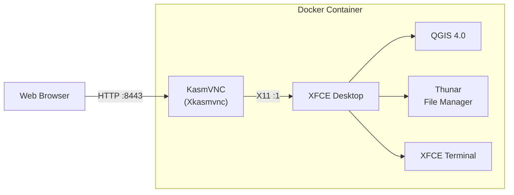

# QGIS Desktop Docker

A fully reproducible, Nix-built Docker image that runs [QGIS](https://qgis.org) inside a minimal XFCE desktop, accessible from any web browser via [KasmVNC](https://kasmweb.com). No VNC client needed -- just open a URL.


## Features

- **Browser-based access** -- connect to a full QGIS desktop from any device with a web browser
- **Multi-monitor support** -- KasmVNC supports dynamic resolution resizing and multiple monitors
- **Fully reproducible** -- the entire image is defined declaratively in a Nix flake
- **Persistent workspaces** -- mount a volume to keep your QGIS projects, plugins, and settings across restarts
- **Minimal footprint** -- only the packages needed to run QGIS and the desktop environment
- **SBOM & CVE scanning** -- every build produces a Software Bill of Materials and vulnerability scan

## Quick Start

### Pull from GHCR

> **Note:** If the package is private, authenticate first: `echo $GITHUB_TOKEN | docker login ghcr.io -u USERNAME --password-stdin`

```bash
docker pull ghcr.io/kartoza/qgis-desktop-docker:latest
docker run --rm -p 8443:8443 ghcr.io/kartoza/qgis-desktop-docker:latest
```

Open [http://localhost:8443](http://localhost:8443) in your browser.

### Using Docker Compose

```bash
curl -O https://raw.githubusercontent.com/kartoza/qgis-desktop-docker/main/docker-compose.yml
docker compose up -d
```

## Usage Examples

### Basic (ephemeral)

```bash
docker run --rm -p 8443:8443 ghcr.io/kartoza/qgis-desktop-docker:latest
```

### Persistent home directory (named volume)

```bash
docker run --rm -p 8443:8443 \
  -v qgis-home:/home/user \
  ghcr.io/kartoza/qgis-desktop-docker:latest
```

QGIS settings, plugins, and projects in `/home/user` survive container restarts.

### Bind mount a local directory

```bash
docker run --rm -p 8443:8443 \
  -v "$HOME/qgis-data:/home/user/data" \
  ghcr.io/kartoza/qgis-desktop-docker:latest
```

### Persistent home + local data

```bash
docker run --rm -p 8443:8443 \
  -v qgis-home:/home/user \
  -v "$HOME/gis-projects:/home/user/projects" \
  ghcr.io/kartoza/qgis-desktop-docker:latest
```

### Custom resolution

```bash
docker run --rm -p 8443:8443 \
  -e VNC_RESOLUTION=1920x1080 \
  ghcr.io/kartoza/qgis-desktop-docker:latest
```

### Custom port

```bash
docker run --rm -p 3000:3000 \
  -e VNC_PORT=3000 \
  ghcr.io/kartoza/qgis-desktop-docker:latest
```

## Docker Compose

```yaml
services:
  qgis-desktop:
    image: ghcr.io/kartoza/qgis-desktop-docker:latest
    ports:
      - "8443:8443"
    environment:
      - VNC_RESOLUTION=1920x1080
    volumes:
      - qgis-home:/home/user
      # Optional: mount a local data directory
      # - ./data:/home/user/data
    restart: unless-stopped

volumes:
  qgis-home:
```

## Environment Variables

| Variable | Default | Description |
|----------|---------|-------------|
| `VNC_PORT` | `8443` | Port for the KasmVNC web interface |
| `VNC_RESOLUTION` | `1280x720` | Initial desktop resolution (resizable in browser) |
| `VNC_COL_DEPTH` | `24` | Color depth (16, 24, or 32) |
| `VNC_PW` | `password` | VNC password (basic auth is disabled by default) |
| `DISPLAY` | `:1` | X display number |

## Endpoints

| URL | Description |
|-----|-------------|
| `http://localhost:8443` | KasmVNC web client (full desktop) |

## Architecture



The container runs a single process tree:

1. **`start-desktop.sh`** -- entrypoint that orchestrates startup
2. **`Xkasmvnc`** -- X server + VNC + embedded web server (KasmVNC)
3. **`dbus-run-session`** -- manages the D-Bus session bus
4. **`startxfce4`** -- launches XFCE window manager, panel, desktop
5. **QGIS** -- available in the applications menu and panel launcher

KasmVNC is driven directly (the `Xkasmvnc` binary) rather than through the `kasmvncserver` Perl wrapper, eliminating a large Perl dependency tree.

## Building from Source

### Prerequisites

- [Nix](https://nixos.org/download) with flakes enabled
- Docker

### Using Nix

```bash
git clone https://github.com/kartoza/qgis-desktop-docker.git
cd qgis-desktop-docker

# Build and load the Docker image
nix run .#build-docker

# Or step by step
nix build .#docker
nix store cat $(nix build .#docker --print-out-paths) | docker load

# Run
docker run --rm -p 8443:8443 nix-xfce-kasm:latest
```

### Using Make

```bash
make build-docker    # Build the image
make run             # Run in foreground
make run-detached    # Run in background
make run-persistent  # Run with persistent home volume
make stop            # Stop the container
make summary         # Generate build summary
make compose-up      # Start with docker-compose
make compose-down    # Stop docker-compose
```

### Available `nix run` commands

```bash
nix run .#build-docker  # Build the Docker image
nix run .#run           # Run the container
nix run .#summary       # Generate build summary
nix run                 # Show help
```

### Development shell

```bash
nix develop
```

Provides docker, python3, syft, grype, jq, and other tools.

## Project Structure

```
flake.nix                    # Main flake: packages, Docker image, apps, dev shell
kasmvnc.nix                  # KasmVNC package (v1.4.0 from Debian Bookworm deb)
libcrypt-compat.nix          # libcrypt.so.1 compat lib from Debian
start-desktop.sh             # Entrypoint: launches Xkasmvnc + XFCE
config/                      # XFCE panel and desktop configuration
docker-compose.yml           # Docker Compose example
Makefile                     # Make targets for build/run/summary
build-summary.sh             # Build summary generator
scripts/
  sbom_table.py              # SBOM JSON to markdown table
  cve_table.py               # Grype CVE JSON to markdown table
.github/workflows/
  docker.yml                 # Unified PR + Release workflow
```

## CI/CD

A single GitHub Actions workflow (`.github/workflows/docker.yml`) handles both PRs and releases.

### On every Pull Request

1. Builds the Docker image with Nix
2. Generates an SBOM (SPDX JSON via anchore/sbom-action)
3. Scans for CVEs (Grype via anchore/scan-action)
4. Generates a build report with image stats, SBOM table, and CVE table
5. Uploads image tarball, SBOM, and CVE scan as **7-day artifacts**
6. Posts/updates a **PR comment** with the full build report

### On every Release

1. Builds the Docker image with Nix
2. Generates SBOM and CVE scan
3. Pushes to **GitHub Container Registry** (`ghcr.io/kartoza/qgis-desktop-docker`)
4. Tags with both version and `latest`
5. Appends build report to release notes
6. Attaches image tarball, `sbom.spdx.json`, and `cve-scan.json` as release assets

## Security & Transparency

Every build generates:

- **[SBOM](https://github.com/kartoza/qgis-desktop-docker/releases/latest)** (`sbom.spdx.json`) -- complete Software Bill of Materials in SPDX JSON format listing every package in the image
- **[CVE Scan](https://github.com/kartoza/qgis-desktop-docker/releases/latest)** (`cve-scan.json`) -- Grype vulnerability scan results with severity ratings

Both are attached to every release and available as artifacts on every PR build.

### Authentication

- **No authentication** is enabled by default (`-SecurityTypes None -disableBasicAuth`). This is intended for local development use.
- For production or multi-user deployments, place the container behind a reverse proxy with authentication (e.g., nginx + OAuth2 Proxy, Traefik + BasicAuth).
- The container runs as a non-root user (`user`, UID 1000).

## License

GPL-2.0 -- see [LICENSE](LICENSE) for details.

KasmVNC is licensed under GPL-2.0. QGIS is licensed under GPL-2.0.

---

Made with love by [Kartoza](https://kartoza.com) | [Donate!](https://github.com/sponsors/kartoza) | [GitHub](https://github.com/kartoza/qgis-desktop-docker)
