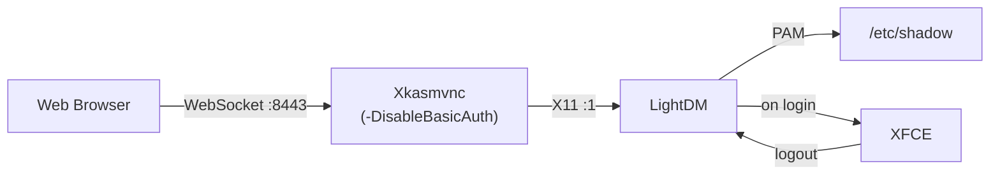
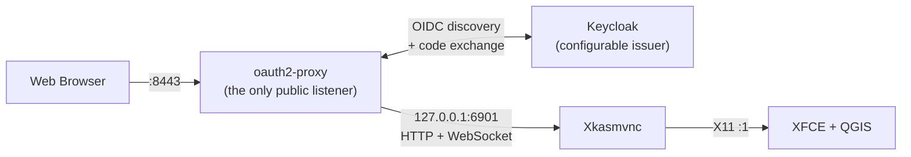

# Authentication

The container offers four auth pathways, selected by `QGIS_DESKTOP_AUTH_MODE`:

| Mode | What the user sees | When to use |
|------|--------------------|-------------|
| `basic` *(default)* | Browser's HTTP Basic Auth dialog | Fast to set up. Fine for a single trusted user. |
| `greeter` | In-desktop LightDM login form | Multiple users, or anywhere users may need to log out / re-authenticate without closing the browser tab. |
| `oidc` | Your identity provider's login page | Single sign-on against Keycloak (or any OIDC provider). Central accounts, MFA, group/role-based access. |
| `none` | No prompt — desktop appears immediately | Local dev only. Never expose to any untrusted network. |

The `KASM_*` names these settings used before 2.0.0 are no longer read — the
container refuses to start and names the replacement. See
[Migrating from 1.x](index.md#migrating-from-1x).

## Variables

| Variable | Default | Description |
|----------|---------|-------------|
| `QGIS_DESKTOP_AUTH_MODE` | `basic` | `none` \| `basic` \| `greeter` \| `oidc` |
| `QGIS_DESKTOP_USERS_FILE` | `/etc/qgis-desktop/users` | Bind-mount target for a `user:password` file. |
| `QGIS_DESKTOP_USERS` | *(none)* | Inline `user1:pw1,user2:pw2` list. Comma or newline separated. |
| `VNC_USER` / `VNC_PW` | `user` / `password` | Legacy single-user fallback. Used when neither of the above are set. |

The `oidc` variables have [their own table](#oidc-variables) below.

## Credential resolution

The `basic`, `greeter` and `none` modes read credentials from the same sources
in the same order, first wins (`oidc` gets its accounts from the identity
provider instead):

1. **`QGIS_DESKTOP_USERS_FILE`** — path to a file containing `user:password` per
   line. Lines starting with `#` and blank lines are ignored. Passwords
   may contain colons; only the first `:` on the line is the separator.
   Mount with mode `0600`.
2. **`QGIS_DESKTOP_USERS`** — inline list. Same semantics as the file.
3. **Legacy `VNC_USER` / `VNC_PW`** — single user.

## `basic` — HTTP Basic Auth (default)

When a browser connects to `:8443`, Xkasmvnc replies `401 WWW-Authenticate:
Basic` and the browser shows its native user/password prompt. Credentials
are reused transparently for the VNC RFB handshake, so users only see one
prompt.

At boot, `start-desktop.sh` wipes any stale `~/.kasmpasswd` and
re-populates it from the resolved source, so removing a user and restarting
takes effect immediately.

!!! note "RFB SecurityTypes is always None"
    The RFB-layer `SecurityTypes` is always `None` — HTTP Basic Auth is
    the sole authentication gate. Setting VncAuth would require a legacy
    `~/.vnc/passwd` file in DES-encoded TigerVNC format, which
    `kasmvncpasswd` does not produce.

**Trade-off.** The browser caches Basic Auth credentials for the tab. If a
user enters the wrong password, there is no clean way to make the browser
re-prompt without closing the tab or clearing site data. That is the
motivation for `greeter` mode below.

## `greeter` — LightDM login form (new in 1.4.0)

`QGIS_DESKTOP_AUTH_MODE=greeter` boots the container with LightDM as the first X
client on the KasmVNC-served display. HTTP Basic Auth is disabled — the
greeter is the auth boundary. The browser connects, sees the LightDM
login form, and the user authenticates against real Linux accounts that
the entrypoint materialises from `QGIS_DESKTOP_USERS_FILE` / `QGIS_DESKTOP_USERS` /
`VNC_USER`+`VNC_PW`.

Why this exists:

- **Clean re-prompt.** Wrong password? LightDM shows an inline error and
  re-prompts. No browser tab to close.
- **Log out affordance.** XFCE's log-out returns to the greeter, so a
  second user can sign in on the same browser tab.
- **Multi-user.** Each entry in `QGIS_DESKTOP_USERS` gets its own real Linux
  account and home directory. Users see each other's session boundaries
  via UNIX permissions.



### Trade-offs

- **Image size.** Adds ~40 MB uncompressed for `lightdm`,
  `lightdm-gtk-greeter`, and their transitive GTK deps.
- **Privileges.** LightDM runs as root inside the container so it can
  spawn each session as its target user. The XFCE session still runs
  unprivileged. Egress-lockdown rules are installed by the root entrypoint
  before LightDM starts and cannot be modified from inside the desktop
  session.
- **Basic mode is unchanged.** Existing deployments continue to work
  bit-identically. The greeter mode is opt-in.

## `oidc` — single sign-on via Keycloak (new in 2.0.0)

`QGIS_DESKTOP_AUTH_MODE=oidc` puts [oauth2-proxy](https://oauth2-proxy.github.io/oauth2-proxy/)
in front of the desktop. It becomes the only listener on the published port,
and KasmVNC is moved to `127.0.0.1:6901` behind it — so an unauthenticated
request never reaches the desktop at all, not even to be refused by it.

The provider defaults to `keycloak-oidc`, which understands Keycloak's realm and
client roles. It speaks ordinary OIDC discovery underneath, so **any** compliant
identity provider works: point `QGIS_DESKTOP_OIDC_ISSUER_URL` at it, and set
`QGIS_DESKTOP_OIDC_PROVIDER=oidc` if you do not need the Keycloak role filtering.



### Setting up the Keycloak client

In your realm, create a client:

| Setting | Value |
|---------|-------|
| Client ID | `qgis-desktop` (anything — it goes in `QGIS_DESKTOP_OIDC_CLIENT_ID`) |
| Client authentication | **On** (a confidential client; the proxy holds a secret) |
| Standard flow | **Enabled** — this is the authorization-code flow |
| Direct access grants | Disabled (not used) |
| Valid redirect URI | `https://gis.example.com/oauth2/callback` |
| Valid web origin | `https://gis.example.com` |

Copy the client secret from the **Credentials** tab. That is everything the
container needs; group or role filtering is optional and configured below.

### Running it

```bash
docker run --rm -p 8443:8443 --cap-add=NET_ADMIN \
  -e QGIS_DESKTOP_AUTH_MODE=oidc \
  -e QGIS_DESKTOP_OIDC_ISSUER_URL=https://sso.example.com/realms/gis \
  -e QGIS_DESKTOP_OIDC_CLIENT_ID=qgis-desktop \
  -e QGIS_DESKTOP_OIDC_CLIENT_SECRET_FILE=/run/secrets/oidc \
  -e QGIS_DESKTOP_OIDC_REDIRECT_URL=https://gis.example.com/oauth2/callback \
  -e QGIS_DESKTOP_OIDC_ALLOWED_ROLES=qgis-user \
  -v /path/to/secret:/run/secrets/oidc:ro \
  ghcr.io/kartoza/qgis-desktop-docker:latest
```

Or, with the same variables exported in your shell, `nix run .#run-oidc`.

For a complete, runnable example — including a throwaway Keycloak with a
pre-imported realm and a user who is deliberately *refused* — see
[Keycloak SSO](../scenarios/keycloak-sso.md).

### OIDC variables

| Variable | Default | Description |
|----------|---------|-------------|
| `QGIS_DESKTOP_OIDC_ISSUER_URL` | *(required)* | Realm/issuer URL, e.g. `https://sso.example.com/realms/gis`. Discovery happens at `<issuer>/.well-known/openid-configuration`. |
| `QGIS_DESKTOP_OIDC_CLIENT_ID` | *(required)* | Client ID registered with the provider. |
| `QGIS_DESKTOP_OIDC_CLIENT_SECRET` | *(required)* | Client secret. Prefer the `_FILE` form below. |
| `QGIS_DESKTOP_OIDC_CLIENT_SECRET_FILE` | *(none)* | Path to a file holding the secret. Read as root before privileges are dropped, so a `0400 root:root` mount works. |
| `QGIS_DESKTOP_OIDC_REDIRECT_URL` | *(required)* | Browser-facing callback URL — this container's public URL + `/oauth2/callback`. Must be registered on the client. |
| `QGIS_DESKTOP_OIDC_COOKIE_SECRET` | *(generated)* | Session encryption key. Generated per boot if unset, which invalidates sessions on restart and breaks multi-replica setups. |
| `QGIS_DESKTOP_OIDC_COOKIE_SECRET_FILE` | *(none)* | File form of the above. Generate with `head -c 32 /dev/urandom \| base64 \| tr -d '=' \| tr '+/' '-_'`. |
| `QGIS_DESKTOP_OIDC_PROVIDER` | `keycloak-oidc` | oauth2-proxy provider. Use `oidc` for a strictly generic provider. |
| `QGIS_DESKTOP_OIDC_SCOPE` | `openid email profile` | Scopes requested. |
| `QGIS_DESKTOP_OIDC_EMAIL_DOMAINS` | `*` | Comma-separated allowlist of email domains. `*` means any account the IdP issues a token for. |
| `QGIS_DESKTOP_OIDC_EMAIL_CLAIM` | `email` | Claim used as the identity. Set to `preferred_username` for realms without verified emails. |
| `QGIS_DESKTOP_OIDC_ALLOWED_GROUPS` | *(none)* | Comma-separated group allowlist, e.g. `/gis-users`. Needs a groups claim mapper on the client. |
| `QGIS_DESKTOP_OIDC_ALLOWED_ROLES` | *(none)* | Comma-separated realm/client role allowlist. Keycloak only. |
| `QGIS_DESKTOP_OIDC_INNER_MODE` | `none` | How the desktop behind the proxy authenticates: `none` (shared session) or `greeter` (per-user Linux session). |
| `QGIS_DESKTOP_OIDC_UPSTREAM_PORT` | `6901` | Loopback port KasmVNC is moved to. |
| `QGIS_DESKTOP_OIDC_LISTEN_PORT` | *(`VNC_PORT`)* | Port the proxy listens on. Defaults to the published port; only set this if the proxy must listen somewhere other than where `VNC_PORT` points. |
| `QGIS_DESKTOP_OIDC_COOKIE_SECURE` | *(from redirect URL)* | `1` marks session cookies Secure. Defaults on for an `https://` redirect URL, off otherwise. |
| `QGIS_DESKTOP_OIDC_COOKIE_EXPIRE` | `8h` | Session lifetime. |
| `QGIS_DESKTOP_OIDC_TLS_CERT_FILE` | *(none)* | Serve HTTPS directly instead of plain HTTP. Requires the key below; setting one without the other is refused. |
| `QGIS_DESKTOP_OIDC_TLS_KEY_FILE` | *(none)* | Private key for the certificate above. |
| `QGIS_DESKTOP_OIDC_REVERSE_PROXY` | `0` | Set to `1` only when a trusted proxy in front sets `X-Forwarded-*`. Enabling it without one lets clients spoof their address. |
| `QGIS_DESKTOP_OIDC_INSECURE_SKIP_VERIFY` | `0` | Skip TLS verification of the IdP. Dev only. |
| `QGIS_DESKTOP_OIDC_EXTRA_ARGS` | *(none)* | Extra oauth2-proxy flags, appended verbatim. |

### How it is wired

- **Secrets never hit a command line.** `qgis-desktop-oidc-config` runs as root at boot,
  reads the secrets, and writes them to `/run/qgis-desktop/oidc/secrets.cfg` mode `0400`
  owned by UID 1000. Neither `ps` inside the container nor `docker inspect`
  outside it shows the secret when you use the `_FILE` variables.
- **The proxy is unprivileged.** It runs under `setpriv` as UID 1000 with all
  capabilities cleared, exactly like the desktop.
- **If the proxy dies, the container dies.** A watchdog signals PID 1 the moment
  the proxy exits, so the desktop can never end up serving with nothing in front
  of it.
- **The IdP is allowlisted automatically.** The egress lockdown is on by default
  with an empty allowlist; the entrypoint adds the issuer's host to it, because
  discovery and the code exchange happen server-side. Everything else stays
  blocked.
- **Nothing is forwarded upstream.** Access tokens and identity headers are not
  passed to KasmVNC — it has no use for them, and forwarding would only widen
  what a compromised desktop process can see.

### Trade-offs

- **The desktop session is shared.** With `QGIS_DESKTOP_OIDC_INNER_MODE=none` every
  authenticated user attaches to the *same* X session and sees the same screen,
  as they do in `basic` mode. Use `greeter` for per-user sessions, or one
  container per user for real isolation.
- **Cookies need TLS.** Over plain HTTP the session cookie cannot be marked
  Secure, and the container says so at boot. Terminate TLS in front of it (or
  set `QGIS_DESKTOP_OIDC_TLS_CERT_FILE`) for anything beyond localhost.
- **Image size.** oauth2-proxy plus a CA bundle add roughly 30 MB uncompressed.
- **DNS is resolved once.** The egress allowlist pins the IdP's addresses at
  startup. If your provider's IPs rotate, add its CIDR to `QGIS_DESKTOP_EGRESS_ALLOW`.

## Examples

**Basic mode (default), multi-user via file:**

```bash
cat > users <<'EOF'
alice:hunter2
bob:correct-horse-battery-staple
EOF
chmod 600 users
docker run --rm -p 8443:8443 --cap-add=NET_ADMIN \
  -v "$PWD/users:/etc/qgis-desktop/users:ro" \
  ghcr.io/kartoza/qgis-desktop-docker:latest
```

**Greeter mode, single default user:**

```bash
docker run --rm -p 8443:8443 --cap-add=NET_ADMIN \
  -e QGIS_DESKTOP_AUTH_MODE=greeter \
  ghcr.io/kartoza/qgis-desktop-docker:latest
# Browser at :8443 shows the LightDM login. Log in as user / password.
```

**Greeter mode, multi-user via env:**

```bash
docker run --rm -p 8443:8443 --cap-add=NET_ADMIN \
  -e QGIS_DESKTOP_AUTH_MODE=greeter \
  -e QGIS_DESKTOP_USERS='alice:pw1,bob:pw2' \
  ghcr.io/kartoza/qgis-desktop-docker:latest
```

**Disable auth (local dev only):**

```bash
docker run --rm -p 8443:8443 --cap-add=NET_ADMIN \
  -e QGIS_DESKTOP_AUTH_MODE=none \
  ghcr.io/kartoza/qgis-desktop-docker:latest
```

**Single sign-on against Keycloak:**

```bash
docker run --rm -p 8443:8443 --cap-add=NET_ADMIN \
  -e QGIS_DESKTOP_AUTH_MODE=oidc \
  -e QGIS_DESKTOP_OIDC_ISSUER_URL=https://sso.example.com/realms/gis \
  -e QGIS_DESKTOP_OIDC_CLIENT_ID=qgis-desktop \
  -e QGIS_DESKTOP_OIDC_CLIENT_SECRET_FILE=/run/secrets/oidc \
  -e QGIS_DESKTOP_OIDC_REDIRECT_URL=https://gis.example.com/oauth2/callback \
  -v /path/to/secret:/run/secrets/oidc:ro \
  ghcr.io/kartoza/qgis-desktop-docker:latest
```

## Branded login page

`greeter` mode ships with a Kartoza-branded LightDM GTK greeter (wallpaper,
Adwaita theme, credit footer). `oidc` mode hands the whole login experience to
your identity provider, so branding lives in the realm's login theme.

If you want something else entirely, front the container with your own reverse
proxy (nginx, Traefik, Caddy + `basic_auth`, …) and set `QGIS_DESKTOP_AUTH_MODE=none` —
but only when that proxy is the sole route to the published port.

!!! tip
    In `basic`, `none` and `oidc` modes the desktop process runs as UID 1000
    after the root entrypoint drops privileges — as does the OIDC proxy. In
    `greeter` mode LightDM runs as root but transitions each session to its
    target user via PAM.

## Troubleshooting `oidc`

| Symptom | Likely cause |
|---------|--------------|
| Container exits at boot with an `ERROR:` from `qgis-desktop-oidc-config` | A required variable is missing or a secret file is unreadable. The message names it. |
| `FATAL: the OIDC proxy exited` | oauth2-proxy could not start — usually discovery failing. Check the IdP is reachable and that the issuer URL has no trailing slash. |
| Redirect loop back to the login page | The session cookie is being dropped: `cookie_secure` is on over plain HTTP, or the browser reaches the container on a different host than `QGIS_DESKTOP_OIDC_REDIRECT_URL`. |
| `Invalid redirect_uri` from Keycloak | The callback URL is not registered on the client. |
| Login succeeds, then *Permission Denied* | Authentication worked but authorisation did not — check `QGIS_DESKTOP_OIDC_ALLOWED_ROLES` / `_GROUPS` and that the client has a groups mapper. |
| Timeout reaching the IdP | Egress lockdown. The issuer host is allowlisted automatically; a *different* host for the token endpoint, or rotating IPs, needs an explicit `QGIS_DESKTOP_EGRESS_ALLOW` entry. |
