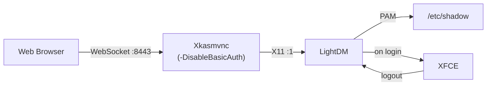

# Authentication

The container offers three auth pathways, selected by `KASM_AUTH_MODE`:

| Mode | What the user sees | When to use |
|------|--------------------|-------------|
| `basic` *(default)* | Browser's HTTP Basic Auth dialog | Fast to set up. Fine for a single trusted user. |
| `greeter` | In-desktop LightDM login form | Multiple users, or anywhere users may need to log out / re-authenticate without closing the browser tab. |
| `none` | No prompt — desktop appears immediately | Local dev only. Never expose to any untrusted network. |

Legacy `KASM_AUTH=0` still forces `none` for backwards compatibility.

## Variables

| Variable | Default | Description |
|----------|---------|-------------|
| `KASM_AUTH_MODE` | `basic` | `none` \| `basic` \| `greeter` |
| `KASM_AUTH` | *(unset)* | Legacy: `0` forces `none`. |
| `KASM_USERS_FILE` | `/etc/kasmvnc/users` | Bind-mount target for a `user:password` file. |
| `KASM_USERS` | *(none)* | Inline `user1:pw1,user2:pw2` list. Comma or newline separated. |
| `VNC_USER` / `VNC_PW` | `user` / `password` | Legacy single-user fallback. Used when neither of the above are set. |

## Credential resolution

All three modes read credentials from the same sources in the same order,
first wins:

1. **`KASM_USERS_FILE`** — path to a file containing `user:password` per
   line. Lines starting with `#` and blank lines are ignored. Passwords
   may contain colons; only the first `:` on the line is the separator.
   Mount with mode `0600`.
2. **`KASM_USERS`** — inline list. Same semantics as the file.
3. **Legacy `VNC_USER` / `VNC_PW`** — single user.

## `basic` — HTTP Basic Auth (default)

When a browser connects to `:8443`, Xkasmvnc replies `401 WWW-Authenticate:
Basic` and the browser shows its native user/password prompt. Credentials
are reused transparently for the VNC RFB handshake, so users only see one
prompt.

At boot, `start-desktop.sh` wipes any stale `~/.kasmpasswd` and
re-populates it from the resolved source, so removing a user and restarting
takes effect immediately.

!!! note "RFB SecurityTypes is always None"
    The RFB-layer `SecurityTypes` is always `None` — HTTP Basic Auth is
    the sole authentication gate. Setting VncAuth would require a legacy
    `~/.vnc/passwd` file in DES-encoded TigerVNC format, which
    `kasmvncpasswd` does not produce.

**Trade-off.** The browser caches Basic Auth credentials for the tab. If a
user enters the wrong password, there is no clean way to make the browser
re-prompt without closing the tab or clearing site data. That is the
motivation for `greeter` mode below.

## `greeter` — LightDM login form (new in 1.4.0)

`KASM_AUTH_MODE=greeter` boots the container with LightDM as the first X
client on the KasmVNC-served display. HTTP Basic Auth is disabled — the
greeter is the auth boundary. The browser connects, sees the LightDM
login form, and the user authenticates against real Linux accounts that
the entrypoint materialises from `KASM_USERS_FILE` / `KASM_USERS` /
`VNC_USER`+`VNC_PW`.

Why this exists:

- **Clean re-prompt.** Wrong password? LightDM shows an inline error and
  re-prompts. No browser tab to close.
- **Log out affordance.** XFCE's log-out returns to the greeter, so a
  second user can sign in on the same browser tab.
- **Multi-user.** Each entry in `KASM_USERS` gets its own real Linux
  account and home directory. Users see each other's session boundaries
  via UNIX permissions.



### Trade-offs

- **Image size.** Adds ~40 MB uncompressed for `lightdm`,
  `lightdm-gtk-greeter`, and their transitive GTK deps.
- **Privileges.** LightDM runs as root inside the container so it can
  spawn each session as its target user. The XFCE session still runs
  unprivileged. Egress-lockdown rules are installed by the root entrypoint
  before LightDM starts and cannot be modified from inside the desktop
  session.
- **Basic mode is unchanged.** Existing deployments continue to work
  bit-identically. The greeter mode is opt-in.

## Examples

**Basic mode (default), multi-user via file:**

```bash
cat > users <<'EOF'
alice:hunter2
bob:correct-horse-battery-staple
EOF
chmod 600 users
docker run --rm -p 8443:8443 --cap-add=NET_ADMIN \
  -v "$PWD/users:/etc/kasmvnc/users:ro" \
  ghcr.io/kartoza/qgis-desktop-docker:latest
```

**Greeter mode, single default user:**

```bash
docker run --rm -p 8443:8443 --cap-add=NET_ADMIN \
  -e KASM_AUTH_MODE=greeter \
  ghcr.io/kartoza/qgis-desktop-docker:latest
# Browser at :8443 shows the LightDM login. Log in as user / password.
```

**Greeter mode, multi-user via env:**

```bash
docker run --rm -p 8443:8443 --cap-add=NET_ADMIN \
  -e KASM_AUTH_MODE=greeter \
  -e KASM_USERS='alice:pw1,bob:pw2' \
  ghcr.io/kartoza/qgis-desktop-docker:latest
```

**Disable auth (local dev only):**

```bash
docker run --rm -p 8443:8443 --cap-add=NET_ADMIN \
  -e KASM_AUTH_MODE=none \
  ghcr.io/kartoza/qgis-desktop-docker:latest
```

## Branded login page

`greeter` mode ships with a Kartoza-branded LightDM GTK greeter (wallpaper,
Adwaita theme, credit footer). If you want an entirely custom brand or
SSO/OIDC, front the container with a reverse proxy (nginx + OAuth2 Proxy,
Traefik, Caddy + `basic_auth`, etc.) and set `KASM_AUTH_MODE=none`.

!!! tip
    In `basic` and `none` modes the desktop process runs as UID 1000 after
    the root entrypoint drops privileges. In `greeter` mode LightDM runs
    as root but transitions each session to its target user via PAM.
