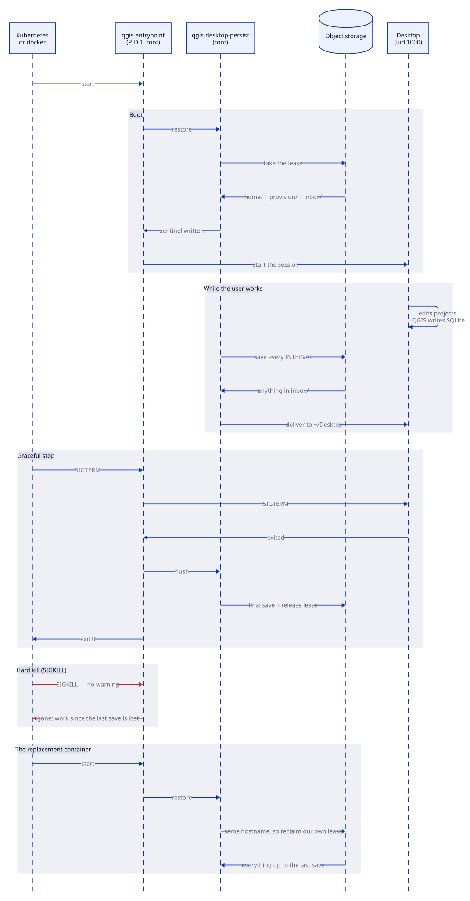
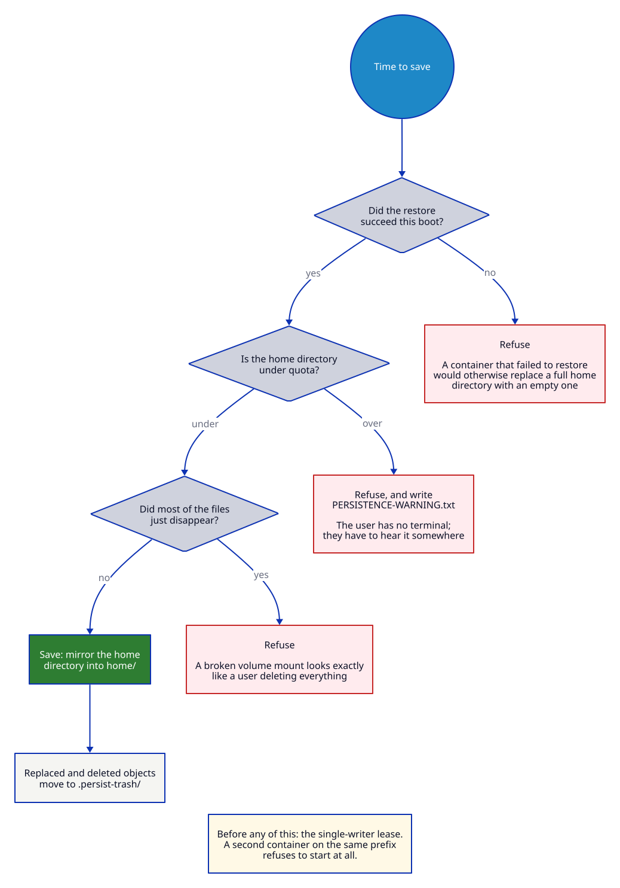

# Home persistence

One user, one container. The home directory is an ordinary local filesystem,
and object storage holds the durable copy: restored before the desktop starts,
saved on an interval and again on the way down. Delete the container, start a
new one against the same bucket prefix, and the user's projects, plugins and
QGIS profile are there.

```bash
docker run --rm -p 8443:8443 --cap-add=NET_ADMIN \
  -e QGIS_DESKTOP_PERSIST=1 \
  -e QGIS_DESKTOP_PERSIST_ENDPOINT=https://fsn1.your-objectstorage.com \
  -e QGIS_DESKTOP_PERSIST_BUCKET=qgis-homes \
  -e QGIS_DESKTOP_PERSIST_PREFIX=alice-9c1f4e2a \
  -e QGIS_DESKTOP_PERSIST_ACCESS_KEY_FILE=/run/secrets/s3-key \
  -e QGIS_DESKTOP_PERSIST_SECRET_KEY_FILE=/run/secrets/s3-secret \
  -e QGIS_DESKTOP_PERSIST_QUOTA=5G \
  -v /etc/qgis-desktop/s3-key:/run/secrets/s3-key:ro \
  -v /etc/qgis-desktop/s3-secret:/run/secrets/s3-secret:ro \
  ghcr.io/kartoza/qgis-desktop-docker:ltr
```

## The shape of it



Three things to take from that picture:

- **The desktop never talks to the bucket.** It reads and writes an ordinary
  local filesystem, with working file locks and no surprises for SQLite. Only
  the sync process, running as root, ever sees object storage.
- **The bucket holds four things, and only one is a mirror.** `home/` is
  overwritten to match the container. `baseline/` and `deploy/` are inputs.
  `.persist-trash/` is what the mirror moved aside.
- **Restore happens before the desktop starts.** That is the only moment root
  writes into the home directory, and there is no user process running yet to
  plant a symlink in the way.

## Why a sync and not a mount

S3 is not a filesystem. A QGIS profile is SQLite — `qgis.db`,
`symbology-style.db` — and so is every GeoPackage. SQLite needs POSIX locking
and atomic partial writes; object-storage FUSE drivers generally provide
neither, and the failure mode is a corrupted profile rather than an error
message. Mounting object storage as `$HOME` trades a bounded, visible risk
(losing the last few minutes of work) for an unbounded, invisible one.

So the desktop always writes to a real filesystem, and the bucket only ever
sees whole files that are already at rest.

!!! warning "The trade-off, stated plainly"
    Work done since the last save is lost if the container dies without
    warning. That window is `QGIS_DESKTOP_PERSIST_INTERVAL` wide — five minutes
    by default. A clean shutdown (`docker stop`, a Kubernetes eviction, a user
    logging out) always saves first.

## The life of a container



The two shutdown paths are the whole trade-off:

| | What happens | What it costs |
|---|---|---|
| **Graceful** — `docker stop`, a Kubernetes eviction, the user logging out | `SIGTERM` reaches PID 1, the desktop is stopped, a final save runs | Nothing |
| **Hard kill** — `docker kill`, `SIGKILL`, the node dying | The container is gone mid-session | Work since the last periodic save |

That is why the entrypoint stays PID 1 when persistence is on: `SIGTERM` is
delivered to PID 1 and nowhere else, so exec'ing the desktop would throw away
the only chance to save. And it is why the interval is the number to think
about — it *is* your worst-case data loss.

## Variables

| Variable | Default | Description |
|----------|---------|-------------|
| `QGIS_DESKTOP_PERSIST` | `0` | `1` turns persistence on. |
| `QGIS_DESKTOP_PERSIST_TYPE` | `s3` | `s3` for any S3-compatible store, or `local` to sync to a mounted directory (a PVC, an NFS export). |
| `QGIS_DESKTOP_PERSIST_BUCKET` | *(required)* | Bucket name, or an absolute path when type is `local`. |
| `QGIS_DESKTOP_PERSIST_PREFIX` | *(required)* | Per-user prefix inside the bucket, e.g. `alice-9c1f4e2a`. Must be relative and must not contain `..`. |
| `QGIS_DESKTOP_PERSIST_ENDPOINT` | *(none)* | Endpoint URL. Required for MinIO, DigitalOcean and Hetzner; its host is added to the egress allowlist automatically. |
| `QGIS_DESKTOP_PERSIST_PROVIDER` | `Other` | rclone's S3 provider name — `Minio`, `DigitalOcean`, `Other`. Affects only provider quirks. |
| `QGIS_DESKTOP_PERSIST_REGION` | `us-east-1` | Region. |
| `QGIS_DESKTOP_PERSIST_ACCESS_KEY` | *(required)* | Access key. Prefer the `_FILE` form. |
| `QGIS_DESKTOP_PERSIST_ACCESS_KEY_FILE` | *(none)* | Path to a file holding the access key. |
| `QGIS_DESKTOP_PERSIST_SECRET_KEY` / `_FILE` | *(required)* | Secret key, same pattern. |
| `QGIS_DESKTOP_PERSIST_SESSION_TOKEN` / `_FILE` | *(none)* | For short-lived STS credentials. |
| `QGIS_DESKTOP_PERSIST_INTERVAL` | `300` | Seconds between saves. |
| `QGIS_DESKTOP_PERSIST_QUOTA` | *(none)* | e.g. `5G`. Over it, saving stops and the user is told. |
| `QGIS_DESKTOP_PERSIST_EXCLUDE` | *(none)* | Comma-separated extra exclude patterns. |
| `QGIS_DESKTOP_PERSIST_TRASH` | `1` | Keep replaced and deleted objects under `.persist-trash/<timestamp>/`. |
| `QGIS_DESKTOP_PERSIST_LEASE` | `1` | Refuse to start if another container is writing this prefix. |
| `QGIS_DESKTOP_PERSIST_LEASE_TTL` | `900` | Seconds before a lease from a dead container is considered stale. |
| `QGIS_DESKTOP_PERSIST_OWNER` | *(hostname)* | Lease identity. See [Kubernetes](#kubernetes) below. |
| `QGIS_DESKTOP_PERSIST_SHRINK_GUARD` | `50` | Refuse to save if the file count dropped below this percentage of the last save. `0` disables. |
| `QGIS_DESKTOP_PERSIST_REQUIRED` | `1` | `1` means a failed restore stops the container instead of serving an empty home. |
| `QGIS_DESKTOP_PERSIST_FLUSH_TIMEOUT` | `25` | Seconds allowed for the final save. Keep it below the shutdown grace period. |
| `QGIS_DESKTOP_PERSIST_HOME` | `/home/user` | What to persist. |
| `QGIS_DESKTOP_PERSIST_BASELINE` | `1` | Apply `baseline/` at every start. See [Giving users data](#giving-users-data). |
| `QGIS_DESKTOP_PERSIST_DEPLOY` | `1` | Deliver `deploy/` into the running desktop. |
| `QGIS_DESKTOP_PERSIST_DEPLOY_DEST` | `Desktop` | Where deploy files land, relative to the home directory. |
| `QGIS_DESKTOP_PERSIST_CREATE_DEPLOY` | `1` | Create `deploy/` at start so it is visible in a bucket browser. `baseline/` is not created — see [Giving users data](#giving-users-data). |

## What is not saved

Caches, session scaffolding and secrets are excluded — they are recreated at
boot and would only slow the restore down:

`.cache/**` · `.local/share/Trash/**` · `.local/share/xorg/**` · `.dbus/**` ·
`.vnc/**` · `.Xauthority` · `.ICEauthority` · **`.kasmpasswd`**

`.kasmpasswd` holds password hashes and is rebuilt from the credential source
on every boot. It has no business in a bucket.

## Giving users data

The bucket prefix holds three directories, and only one of them is a mirror:

```text
s3://qgis-homes/alice-9c1f4e2a/
├── home/            the user's home directory — a MIRROR of the container
├── baseline/       baseline material, applied at every start
├── deploy/          one-time delivery into the running desktop
└── .persist-trash/  what the mirror moved aside
```

!!! danger "`home/` is one-way. Never put files there."
    **`home/` only ever travels container → bucket.** It is a *mirror* of what
    the desktop has, not a drop box, and uploading into it does not give the
    user the file.

    Worse, it takes something away. A file that is in the bucket but not in the
    container is indistinguishable from a file the user deleted — so the next
    save deletes it again, into `.persist-trash/<timestamp>/`. Recoverable, but
    gone from the desktop, and gone from `home/`.

    The only moment anything travels bucket → home is the restore, before the
    desktop starts. To hand a user a file while they are working, use
    **`deploy/`**.

### How a file reaches a user

Upload to `deploy/`, and the running container does the rest:

```text
1. you upload            s3://…/alice-9c1f4e2a/deploy/parcels.gpkg
2. next sync tick        copied into ~/Desktop/parcels.gpkg, owned by the user
3. immediately after     deleted from deploy/  ← delivered once, never again
4. next save             mirrored back to the bucket as home/Desktop/parcels.gpkg
```

Step 3 is why it is safe to leave the prefix empty and reuse it: the file is not
handed over repeatedly, and if the user deletes it, it does not come back. Step 4
is why the file is not lost — once delivered it is the user's own file, so the
mirror keeps it like anything else in their home directory.

If the delivery fails — the container is down, the copy errors — nothing is
deleted. The files stay in `deploy/` and are retried on the next cycle, so a
container that is offline when you upload picks the file up when it starts.

**`deploy/` is created for you at every start**, so it is already there when you
open the bucket to send someone a file. S3 has no directories, so without this
the delivery path would be invisible until somebody guessed the name and
hand-created the path. It is a zero-byte directory marker: rclone ignores
markers when listing, so an empty `deploy/` is still nothing to deliver, and the
prefix survives a delivery that empties it.

`baseline/` is deliberately **not** created. The two prefixes are used at
different moments: `deploy/` is where somebody drops a file in reaction to a
request, so it has to be waiting for them; `baseline/` is set up once when a
deployment is designed, by whoever is already scripting the bucket. An empty
`baseline/` on every home would just be clutter implying an action nobody needs
to take. Create it by putting something in it:

```bash
aws s3 cp --recursive ./kit/ s3://qgis-homes/alice-9c1f4e2a/baseline/
```

Set `QGIS_DESKTOP_PERSIST_CREATE_DEPLOY=0` to stop `deploy/` being created —
worth doing only when the container's credential may not write outside `home/`.

### `baseline/` — baseline material

Copied into the home directory **every time a container starts**. Never
uploaded, never removed from the bucket, and it never overwrites a file the
user already has.

```bash
rclone copy ./house-style.qml remote:qgis-homes/alice-9c1f4e2a/baseline/templates/
rclone copy ./basemap.gpkg    remote:qgis-homes/alice-9c1f4e2a/baseline/data/
```

The layout is preserved: `baseline/Desktop/logo.png` lands on the desktop,
`baseline/templates/x.qml` in `~/templates`. Good for templates, corporate
styles, a starter project, reference layers.

Because it never overwrites, **updating a baseline file does not reach users
who already have it**. That is the right default — it cannot eat someone's
work — but it means `baseline/` is for the *initial* copy. Use `deploy/` to
push out a new version.

### `deploy/` — one-time delivery

Delivered into the running desktop within one save interval, then **cleared
from the bucket**. Drop a file in, it appears; delete it on the desktop and it
does not come back.

```bash
rclone copy ./aerial-2026.tif remote:qgis-homes/alice-9c1f4e2a/deploy/
# within QGIS_DESKTOP_PERSIST_INTERVAL seconds it is on the user's desktop
```

Files land in `~/Desktop` so they are visible immediately;
`QGIS_DESKTOP_PERSIST_DEPLOY_DEST=incoming` puts them in `~/incoming` instead.

To force a delivery without waiting for the next cycle:

```bash
docker exec <container> qgis-desktop-persist deliver
```

### How they are delivered

Both are downloaded as root into a staging directory, then copied into the home
**as the desktop user** — never as root. `deploy/` drains into a session that is
already running, where the user can create symlinks in their own home; a
root-owned copy would follow one and write wherever it pointed. Running the copy
as uid 1000 means it can only reach what that user could already reach.

`deploy/` is cleared only *after* a successful delivery, so a failure leaves the
files in the bucket to be retried rather than losing them.

## Safeguards

The failure this feature has to avoid is not "the save didn't happen" — it is
"the save happened, and replaced good data with bad".



Five guards exist for that:

| Guard | What it stops |
|-------|---------------|
| **Restore sentinel** | A container that failed to restore never saves. Without this, one bad boot replaces a full home directory with an empty one. |
| **Fail closed on restore** | `QGIS_DESKTOP_PERSIST_REQUIRED=1` stops the container rather than presenting an empty home the user would mistake for their own. |
| **Shrink guard** | A home that lost most of its files is not mirrored. A broken volume mount looks exactly like "the user deleted everything". |
| **Trash** | Replaced and deleted objects move to `.persist-trash/<timestamp>/` instead of vanishing, so a bad save is recoverable without provider-side versioning. |
| **Single-writer lease** | Two containers on one prefix means whichever saves last wins and the other's work is gone. The second one refuses to start. |

Recovering something from the trash:

```bash
rclone --config … copy remote:qgis-homes/alice-9c1f4e2a/.persist-trash/20260815T080512Z/projects/city.qgs ./
```

Turn on bucket versioning as well if your provider supports it. The trash is a
client-side safety net that works everywhere; versioning is the real one.

## Kubernetes

This is the environment the guards were written for — pods are deleted and
recreated without ceremony.

```yaml
apiVersion: apps/v1
kind: StatefulSet          # not a Deployment: see the lease note below
spec:
  replicas: 1
  template:
    spec:
      terminationGracePeriodSeconds: 60   # must exceed FLUSH_TIMEOUT
      containers:
        - name: qgis-desktop
          image: ghcr.io/kartoza/qgis-desktop-docker:ltr
          env:
            - name: QGIS_DESKTOP_PERSIST
              value: "1"
            - name: QGIS_DESKTOP_PERSIST_SECRET_KEY_FILE
              value: /run/secrets/s3/secret
          volumeMounts:
            - name: home              # a real volume, so a restart that keeps
              mountPath: /home/user   # the node does not re-download anything
            - name: s3-credentials
              mountPath: /run/secrets/s3
              readOnly: true
      volumes:
        - name: home
          emptyDir:
            sizeLimit: 5Gi
        - name: s3-credentials
          secret:
            secretName: qgis-desktop-s3
            defaultMode: 0400
```

Three things matter here:

- **`terminationGracePeriodSeconds` must exceed `QGIS_DESKTOP_PERSIST_FLUSH_TIMEOUT`.**
  Kubernetes sends `SIGTERM`, waits, then `SIGKILL`s. The container stays PID 1
  precisely to catch that `SIGTERM` and run a last save; too short a grace
  period and the save is cut off. A `SIGKILL` with no warning falls back to the
  last periodic save.
- **StatefulSet, not Deployment.** The lease is keyed on the hostname, and a
  StatefulSet pod keeps its name across restarts — so a recreated pod reclaims
  its own lease immediately, while a genuinely concurrent second pod is still
  refused. On a Deployment every pod gets a new name, so set
  `QGIS_DESKTOP_PERSIST_OWNER` to something stable instead.
- **Give `/home/user` a real volume.** The sync is for surviving the *node*, not
  the process. A volume that outlives the container makes restarts instant, and
  `sizeLimit` gives the quota something to mean.

### `runAsUser` / `runAsGroup`

```yaml
      containers:
        - name: qgis-desktop
          securityContext:
            runAsUser: 1000
            runAsGroup: 1000
          env:
            - name: QGIS_DESKTOP_EGRESS_LOCKDOWN
              value: "0"   # a non-root PID 1 never gets to use NET_ADMIN
```

A pod started this way never has a root phase — the container is uid 1000 from
the first instruction, not root-then-drop. `QGIS_DESKTOP_PERSIST` still works
here: `/run/qgis-desktop/persist` and `/run/qgis-desktop/staging` ship in the
image already owned by uid 1000, precisely so `qgis-desktop-persist` can write
into them without ever being root. What does not survive is the credential
isolation described in
[How the credentials are kept from the user](#how-the-credentials-are-kept-from-the-user)
— read that section before relying on this mode with anything but disposable,
narrowly-scoped bucket credentials.

The egress lockdown does not work here either, for the same reason: `nft`
needs `CAP_NET_ADMIN` as an effective capability, and a process that starts as
uid 1000 rather than execve'ing down from root never has it, `cap_add` on the
container notwithstanding. Set `QGIS_DESKTOP_EGRESS_LOCKDOWN=0` and control
egress at the network policy layer instead.

## Quota

`QGIS_DESKTOP_PERSIST_QUOTA` is enforced client-side: usage is measured before
each save, and over the limit the save is skipped and a
`PERSISTENCE-WARNING.txt` appears in the user's home directory saying — in
those words — that nothing is being saved. It clears itself once usage drops.

!!! note "`df` inside the desktop does not show this"
    The desktop's `df` reports the container filesystem, because that is what
    the home directory actually is. Object stores have no per-prefix quota to
    report:
    [MinIO's quotas are per bucket](https://github.com/minio/minio/discussions/14467),
    and DigitalOcean and Hetzner have none at all. If you want the number in
    `df` to mean something, size the volume behind `/home/user` to match the
    quota — then the filesystem enforces it and reports it, and this setting is
    just the backstop that keeps the bucket from growing past it.

## One bucket, many prefixes

Use a single bucket with one prefix per user, not a bucket per user:
[DigitalOcean](https://docs.digitalocean.com/products/spaces/details/limits/)
and [Hetzner](https://docs.hetzner.com/storage/object-storage/faq/buckets-objects/)
both cap an account at 100 buckets. A `<username>-<uuid>` prefix also means a
recreated account never inherits the previous holder's data.

Scope each container's credentials to its own prefix, server-side — an IAM
policy on `arn:aws:s3:::qgis-homes/alice-9c1f4e2a/*`, ideally short-lived STS
credentials via `QGIS_DESKTOP_PERSIST_SESSION_TOKEN`. The container never
validates its own prefix boundary and should not be trusted to.

## How the credentials are kept from the user

The desktop user has a Python console in QGIS: assume they can run anything as
uid 1000 and read anything that uid can read.

- The sync runs as **root**, and writes the rclone configuration to
  `/run/qgis-desktop/persist/rclone.conf` mode `0400`, root-owned. uid 1000
  cannot read it.
- The credentials are **removed from the environment** before the desktop
  starts, so `/proc/self/environ` in the session does not carry them.
- `rclone` is not on the desktop user's `PATH`, and the persistence command
  cannot be usefully run by uid 1000 — its state directory is root-only.
- The restore is the only moment root writes into the home directory, and it
  happens before any user process exists. Every later transfer reads locally
  and writes remotely, with symlinks skipped rather than followed.

!!! danger "Use the `_FILE` variables"
    `-e QGIS_DESKTOP_PERSIST_SECRET_KEY=…` puts the secret in the container's
    configuration, where `docker inspect` and `kubectl describe` will show it
    to anyone who can reach the daemon or the API. The `_FILE` form reads it
    from a mount instead — root-owned `0400`. The value never enters the
    environment at all.

!!! warning "None of this holds under `runAsUser`"
    Everything above assumes the entrypoint gets a root phase before it drops
    to uid 1000. A pod with `securityContext.runAsUser: 1000` (see
    [Kubernetes](#kubernetes) below) never gets one — the container starts as
    uid 1000 directly, so there is no privilege to hide the credentials from
    in the first place. `rclone.conf` ends up owned by the same uid the
    desktop session runs as, mode `0400` still, but that no longer means
    anything: the owner can always read its own `0400` file. The container
    logs a `WARN` about this every time it writes the file, rather than let it
    pass quietly. Persistence still works in this mode; it just cannot promise
    the QGIS Python console can't read its own object-store credentials.

## Checking on it

```bash
docker exec <container> qgis-desktop-persist status
```

```text
Persistence: enabled
  type:      s3
  remote:    persist:qgis-homes/alice-9c1f4e2a/home
  endpoint:  http://minio:9000
  local:     /home/user
  interval:  300s
  quota:     5G
  trash:     on
  lease:     on (900s)
  restored:  2026-08-15T08:05:12Z
  usage:     130K in 38 file(s)
```

`qgis-desktop-persist push` forces a save; `qgis-desktop-persist release
--force` clears a lease left behind by a container that is definitely gone.
Both must be run as root — `docker exec` without `-u` already is.
