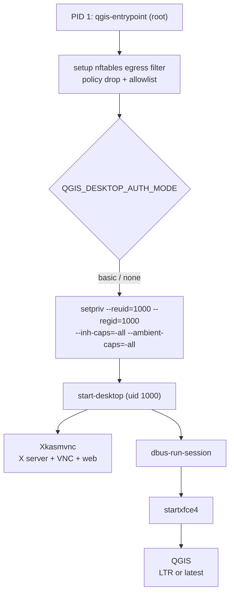
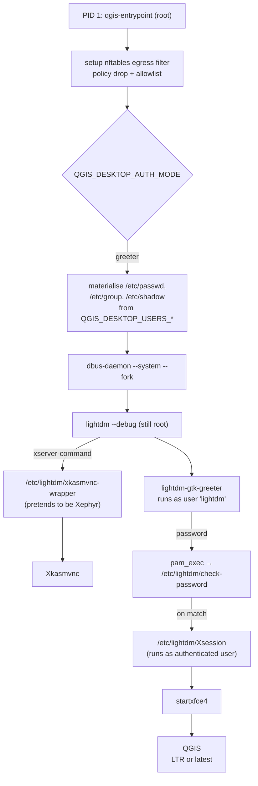
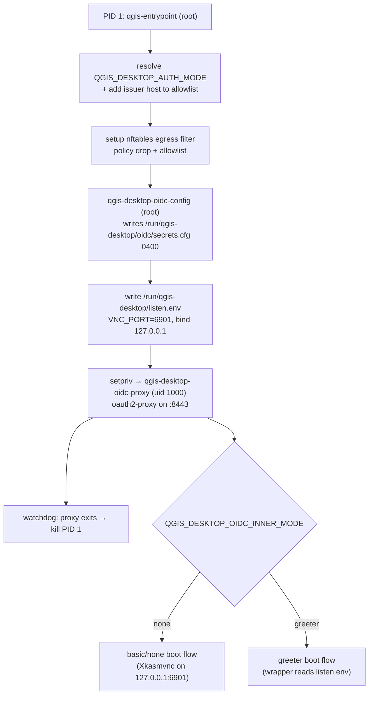

# Architecture

The container has one job: run QGIS in an XFCE desktop that a browser can
reach over HTTP. Getting there involves a deliberate root-then-drop boot
flow so the egress firewall can be enforced without letting the desktop
tamper with it. Since 1.4.0 the boot path branches on `QGIS_DESKTOP_AUTH_MODE` —
`basic`/`none` follow the historical "start-desktop drops to uid 1000"
route, and `greeter` keeps LightDM running as root inside the container
so it can spawn each user session under its own UID.

Since 2.0.0 there is a fourth mode, `oidc`, which is not a fifth boot path but
a *wrapper* around the others: an OIDC proxy takes over the published port, the
desktop is rebound to loopback, and the boot then continues into whichever
inner mode was asked for (`none` by default, or `greeter`).

## Boot flow — `basic` / `none` (default)

## Boot flow — `greeter`

## Boot flow — `oidc`

Two details are load-bearing:

- **The auth mode is resolved *before* the firewall is installed.** The proxy
  performs OIDC discovery and the code exchange server-side, so the issuer's
  host has to be in the allowlist — the entrypoint appends it itself.
- **The listener override is written to a file, not just exported.** LightDM
  spawns the X server with a scrubbed environment, so in `oidc` + `greeter` the
  only channel that reaches `xkasmvnc-wrapper` is `/run/qgis-desktop/listen.env`. Both
  launchers parse it key by key rather than sourcing it: it is written by root
  and read by an unprivileged process.

## Stages — common to all modes

**1. `qgis-entrypoint` (root, PID 1)**

The `Cmd` set by the flake. It:

- Reads `QGIS_DESKTOP_EGRESS_LOCKDOWN` and `QGIS_DESKTOP_EGRESS_ALLOW`.
- If lockdown is on: calls `nft list ruleset` to confirm `NET_ADMIN` is
  present; fails closed with a diagnostic if not.
- Resolves every hostname in the allowlist via `getent ahostsv4` and
  builds an nftables ruleset with `policy drop` on the output chain plus
  `accept` rules for loopback, established/related, DNS, and the resolved
  allowlist.
- Prepares `/tmp/.X11-unix` (root:root, mode 1777), `/tmp/.ICE-unix`
  (root:root, mode 1777 — XSMP socket dir XFCE's session manager needs),
  and `/tmp/runtime-user` (1000:1000, mode 700). Doing this as root before
  any privilege drop keeps Xkasmvnc and xfce4-session happy.
- Reads `QGIS_DESKTOP_AUTH_MODE` (default `basic`) and dispatches:

    * `basic` / `none` — [stage 2A](#stage-2a-basic-none) below.
    * `greeter` — [stage 2B](#stage-2b-greeter) below.
    * `oidc` — [stage 2C](#stage-2c-oidc) below, which then continues into
      2A or 2B depending on `QGIS_DESKTOP_OIDC_INNER_MODE`.

## Stage 2A — `basic` / `none`

**`setpriv` → `start-desktop` (uid 1000)**

- Execs `setpriv --reuid=1000 --regid=1000 --init-groups
  --inh-caps=-all --ambient-caps=-all -- start-desktop`.

The unprivileged desktop entrypoint (`start-desktop.sh`) then:

- Normalises the `KASM_*` env vars, echoes the effective config, wipes any
  stale X lock or socket.
- Populates `~/.kasmpasswd` from `QGIS_DESKTOP_USERS_FILE`, else `QGIS_DESKTOP_USERS`,
  else `VNC_USER`/`VNC_PW`. In `none` mode this step is skipped and
  Xkasmvnc gets `-DisableBasicAuth`.
- Builds the DLP argv (`-AcceptCutText`, `-SendCutText`, `-SendPrimary`,
  `-DLP_*`, `-DLP_WatermarkText` with `${USER}` expanded).
- Writes `~/.vnc/xstartup` — a small script that seeds the wallpaper
  xfconf channel, then runs `dbus-run-session startxfce4`.
- Launches `Xkasmvnc` in the background with the assembled flags, waits
  for `/tmp/.X11-unix/X<n>` to appear, then runs the xstartup script.
- `wait`s on `Xkasmvnc` so the container exits when it does.

## Stage 2B — `greeter`

**User materialisation (root)**

Rather than drop privileges, the entrypoint materialises real Linux user
accounts from the credential sources and hands X server + auth
lifecycle to LightDM.

- `/etc/passwd`, `/etc/group`, `/etc/shadow` are dereferenced into real
  writable files (they may have been read-only symlinks into the nix
  store).
- For each entry in `QGIS_DESKTOP_USERS_FILE` / `QGIS_DESKTOP_USERS` / legacy
  `VNC_USER`+`VNC_PW`, the entrypoint appends a `/etc/passwd` line with a
  fresh UID (starting at 1001) and creates `/home/<user>` with mode 0700.
- The password is hashed with `openssl passwd -6` (sha512crypt) and
  written directly into `/etc/shadow` — the entrypoint deletes any
  existing line for the user and appends the new one. `chpasswd` is
  bypassed because pam_unix's helper (`unix_chkpwd`) isn't SUID in this
  container and returns `PAM_AUTHINFO_UNAVAIL`.

**dbus system bus + LightDM**

- Starts `dbus-daemon --system --fork` so lightdm can register
  `org.freedesktop.DisplayManager`.
- Exports `DBUS_SYSTEM_BUS_ADDRESS` because nixpkgs' dbus is often
  compiled with a different default socket path than our system.conf
  uses.
- Prepends `/usr/bin` to PATH so lightdm can find our `Xephyr` shim.
- `exec lightdm --debug` — lightdm now owns PID 1.

**Xkasmvnc under LightDM**

LightDM's `[Seat:*] xserver-command` is set to
`/etc/lightdm/xkasmvnc-wrapper`, and the flake also symlinks
`/usr/bin/Xephyr`, `/usr/bin/X`, and `/usr/bin/Xorg` to the same wrapper
so *whichever* binary name lightdm's built-in seat logic picks up
resolves to the same script.

The wrapper:

- Parses LightDM's Xorg-style argv (`:N -auth /path -nolisten tcp
  -novtswitch ...`), keeps the display + auth file, drops the rest.
- Launches Xkasmvnc in the background with all the DLP flags the
  container's env vars specify.
- Polls `/tmp/.X11-unix/X<n>` and, once the socket appears, sends
  `SIGUSR1` to LightDM *from its own PID* (the one LightDM registered as
  the X server). Without this, LightDM waits forever on the ready signal
  — Xvnc doesn't implement the X convention of signalling its parent.
- Forwards TERM / INT / HUP to the child so LightDM can stop the X
  server cleanly.

**PAM auth via `pam_exec`**

`/etc/pam.d/lightdm` uses `pam_exec.so` pointing at
`/etc/lightdm/check-password` (a `writeShellApplication` in the flake so
`bash` + `openssl` are on its PATH). That script reads the password from
stdin, looks up the user's shadow entry, and re-hashes with the same
salt. `pam_permit` follows on the auth stack so `pam_setcred()`, which
lightdm calls before spawning the session, gets a module that returns
`PAM_SUCCESS`.

**Session — `/etc/lightdm/Xsession`**

A nix-built `writeShellScript` that lightdm runs as the authenticated
user. It:

- Re-exports the env vars lightdm strips (`FONTCONFIG_FILE`,
  `XDG_DATA_DIRS`, `XDG_CONFIG_DIRS`, `XKB_BASE_DIR`,
  `XDG_RUNTIME_DIR`) with nix-store paths baked in at build time.
- Seeds `~/.config/xfce4/xfconf/xfce-perchannel-xml/xfce4-desktop.xml`
  and `~/.config/xfce4/panel/default.xml` from the system-wide copies
  under `/etc/xdg/` and `/home/user/.config/xfce4/`.
- Backgrounds `dbus-run-session -- startxfce4` and, after 3s, force-sets
  the wallpaper via `xfconf-query` on all three candidate monitor paths
  (`monitorscreen`, `monitor0`, `monitorVNC-0`) — KasmVNC's monitor name
  varies with client capabilities.

## Stage 2C — `oidc`

**`qgis-desktop-oidc-config` (root) → `setpriv` → `qgis-desktop-oidc-proxy` (uid 1000)**

Before the desktop starts at all, the entrypoint:

- Runs `qgis-desktop-oidc-config`, which validates the `QGIS_DESKTOP_OIDC_*` configuration,
  reads the client secret (from a file that may be root-only), generates a
  cookie secret if none was supplied, and writes both to
  `/run/qgis-desktop/oidc/secrets.cfg` mode `0400` owned by UID 1000. A non-zero exit
  is fatal — the container refuses to boot rather than serve unauthenticated.
- Writes `/run/qgis-desktop/listen.env` with `VNC_PORT=6901` and
  `QGIS_DESKTOP_BIND_INTERFACE=127.0.0.1`. Both KasmVNC launchers parse it (key by
  key, never sourced) so the desktop binds loopback only.
- Starts `qgis-desktop-oidc-proxy` under `setpriv --reuid=1000 --inh-caps=-all
  --ambient-caps=-all`. It builds the oauth2-proxy flag list from the
  environment — everything except the secrets, which come from the config
  file — and execs it on the published port.
- Forks a watchdog that polls the proxy's PID (checking `/proc` for the zombie
  state, since an unreaped child still answers `kill -0`) and sends `SIGTERM`
  to PID 1 when it dies.

Control then falls through to stage 2A or 2B for the desktop itself, with
`QGIS_DESKTOP_AUTH_MODE` rewritten to the inner mode so `start-desktop.sh` sees a mode
it knows.

## XFCE + QGIS

`startxfce4` brings up `xfwm4`, `xfce4-panel`, `xfdesktop`, and
`xfsettingsd`. QGIS is on the panel and in the applications menu. Thunar
and `xfce4-terminal` are available for file management and shell access
inside the session, and `mousepad` (GUI, via the applications menu) and
`nano` (terminal) cover plain text editing.

## Why root first, then drop (or keep as root, for greeter)?

Only root can call `nft` to install a filter that binds to the container's
network namespace. If the desktop process itself had `NET_ADMIN`, a
compromised QGIS plugin — or the user simply typing `nft flush ruleset`
in the terminal — could remove the filter.

For `basic` / `none`: `setpriv` clears the inheritable and ambient
capability sets before it execs `start-desktop`, so the desktop and every
descendant it spawns (terminal, plugin, dbus service, whatever) run
without `NET_ADMIN`. The container still holds the capability at the OCI
level, but the running process tree cannot use it.

For `greeter`: LightDM stays root so it can transition each authenticated
session to its target user via PAM's `pam_setcred` + setuid — the XFCE
session itself still runs unprivileged as the authenticated user, so the
attacker-facing surface is unchanged from the `basic` mode session
perspective. The nftables filter is installed *before* LightDM starts, so
even a root exploit inside lightdm can only add rules; the OCI-level
capability isolation still applies.

Verify inside the XFCE terminal (any mode): `nft list ruleset` returns
`Operation not permitted`.

## Why bypass `kasmvncserver`?

KasmVNC ships a Perl wrapper (`kasmvncserver`) that reads a YAML config,
writes a per-user `kasmvnc.yaml`, and forks `Xkasmvnc`. We drive
`Xkasmvnc` directly and pass all flags on the command line. This drops the
Perl dependency tree and makes the effective config visible in `ps`
output — and in `greeter` mode makes it much easier to slot Xkasmvnc into
LightDM's xserver-command hole.

## Why can't we just use `pam_unix`?

`pam_unix.so` in the nixpkgs container delegates to `unix_chkpwd`, a
helper program that expects to be SUID root so it can read `/etc/shadow`
when the caller isn't root (which is the case here — lightdm's session
child `setuid()`s to the target user before calling `pam_authenticate()`).
`unix_chkpwd` in nixpkgs isn't SUID inside the docker image, so
pam_unix returns `PAM_AUTHINFO_UNAVAIL` regardless of `/etc/shadow`
permissions. `pam_exec` with our own verifier sidesteps that entirely,
and lets us keep the credential store (sha512crypt hashes in
`/etc/shadow`) exactly the same shape a real Linux system uses.
