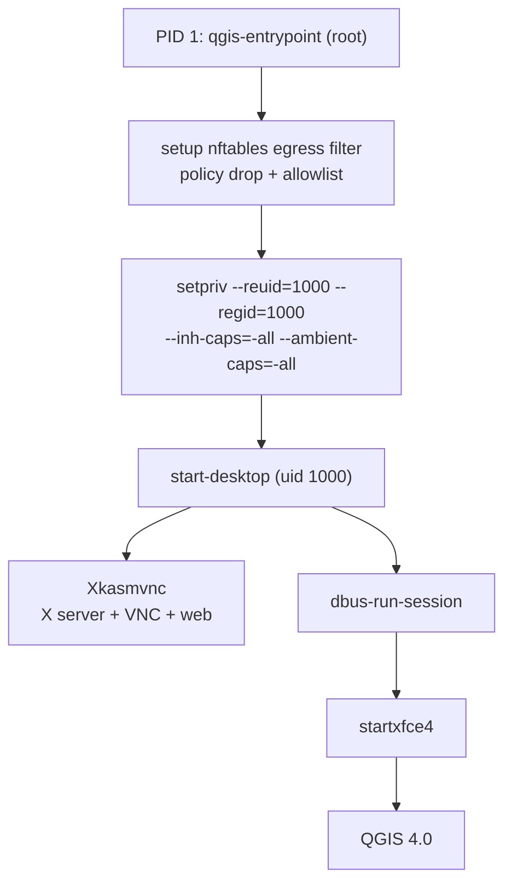

# Architecture

The container has one job: run QGIS in an XFCE desktop that a browser can
reach over HTTP. Getting there involves a deliberate root-then-drop boot
flow so the egress firewall can be enforced without letting the desktop
tamper with it.

## Boot flow

## Stages

**1. `qgis-entrypoint` (root, PID 1)**

The `Cmd` set by the flake. It:

- Reads `KASM_EGRESS_LOCKDOWN` and `KASM_EGRESS_ALLOW`.
- If lockdown is on: calls `nft list ruleset` to confirm `NET_ADMIN` is
  present; fails closed with a diagnostic if not.
- Resolves every hostname in the allowlist via `getent ahostsv4` and
  builds an nftables ruleset with `policy drop` on the output chain plus
  `accept` rules for loopback, established/related, DNS, and the resolved
  allowlist.
- Prepares `/tmp/.X11-unix` (root:root, mode 1777) and `/tmp/runtime-user`
  (1000:1000, mode 700). Doing this as root before the drop keeps Xkasmvnc
  from logging `_XSERVTransmkdir: Owner of /tmp/.X11-unix should be set to
  root` warnings.
- Execs `setpriv --reuid=1000 --regid=1000 --init-groups
  --inh-caps=-all --ambient-caps=-all -- start-desktop`.

**2. `start-desktop` (uid 1000)**

The unprivileged desktop entrypoint. It:

- Normalises the `KASM_*` env vars, echoes the effective config, wipes any
  stale X lock or socket.
- Populates `~/.kasmpasswd` from `KASM_USERS_FILE`, else `KASM_USERS`,
  else `VNC_USER`/`VNC_PW`.
- Builds the DLP argv (`-AcceptCutText`, `-SendCutText`, `-SendPrimary`,
  `-DLP_*`, `-DLP_WatermarkText` with `${USER}` expanded).
- Writes `~/.vnc/xstartup` — a small script that seeds the wallpaper
  xfconf channel, then runs `dbus-run-session startxfce4`.
- Launches `Xkasmvnc` in the background with the assembled flags, waits
  for `/tmp/.X11-unix/X<n>` to appear, then runs the xstartup script.
- `wait`s on `Xkasmvnc` so the container exits when it does.

**3. XFCE + QGIS**

`startxfce4` brings up `xfwm4`, `xfce4-panel`, `xfdesktop`, and
`xfsettingsd`. QGIS is on the panel and in the applications menu. Thunar
and `xfce4-terminal` are available for file management and shell access
inside the session.

## Why root first, then drop?

Only root can call `nft` to install a filter that binds to the container's
network namespace. If the desktop process itself had `NET_ADMIN`, a
compromised QGIS plugin — or the user simply typing `nft flush ruleset`
in the terminal — could remove the filter.

`setpriv` clears the inheritable and ambient capability sets before it
execs `start-desktop`, so the desktop and every descendant it spawns
(terminal, plugin, dbus service, whatever) run without `NET_ADMIN`. The
container still holds the capability at the OCI level, but the running
process tree cannot use it. Verify with `nft list ruleset` inside the
XFCE terminal: it returns `Operation not permitted`.

## Why bypass `kasmvncserver`?

KasmVNC ships a Perl wrapper (`kasmvncserver`) that reads a YAML config,
writes a per-user `kasmvnc.yaml`, and forks `Xkasmvnc`. We drive
`Xkasmvnc` directly and pass all flags on the command line. This drops the
Perl dependency tree and makes the effective config visible in `ps` output.
