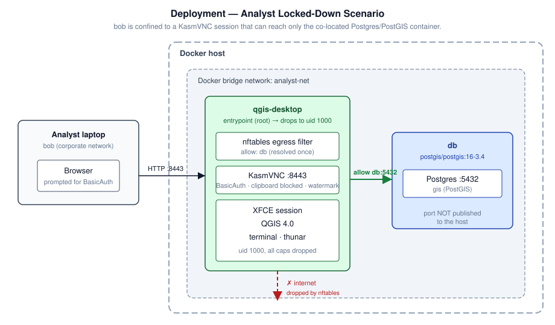
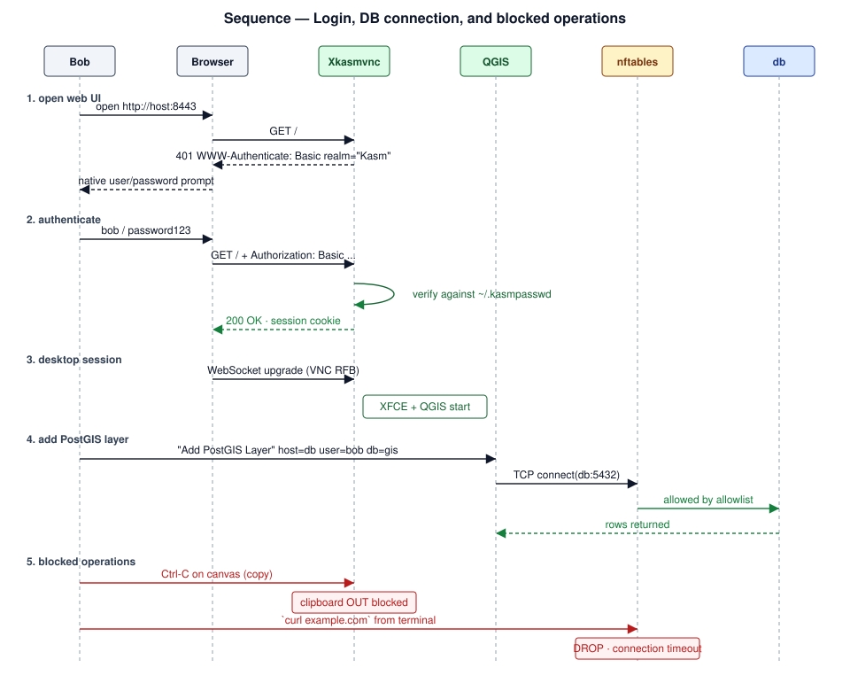
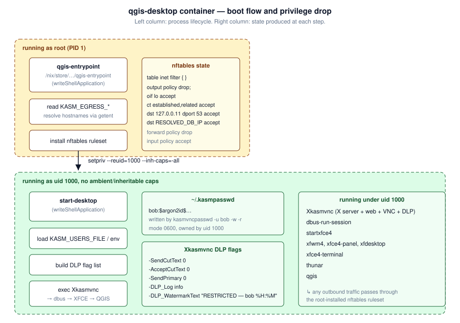

# Scenario: Analyst Locked-Down Session

A single analyst — **bob** — is granted access to a QGIS desktop that can talk
to *one* Postgres/PostGIS database (`db`) and nothing else. Copy/paste is
disabled, screenshots are watermarked, and the container is fenced off from
the general internet.

This document describes what the scenario enforces, how it is wired up, and
how to run and verify it end-to-end.

---

## 1. Requirements

| # | Requirement | How the container satisfies it |
|---|-------------|--------------------------------|
| R1 | Only bob may sign in. | `QGIS_DESKTOP_USERS=bob:password123` populates `~/.kasmpasswd`; all other legacy accounts wiped on boot. |
| R2 | The browser must prompt for user + password. | HTTP BasicAuth is on by default; browser returns `401 WWW-Authenticate: Basic` until valid creds are supplied. |
| R3 | Bob cannot copy data out of the desktop. | `-SendCutText 0` (server → client). |
| R4 | Bob cannot paste data into the desktop. | `-AcceptCutText 0` (client → server). |
| R5 | X primary selection (middle-click paste) is disabled. | `-SendPrimary 0`. |
| R6 | The desktop is visibly watermarked. | `-DLP_WatermarkText "RESTRICTED - bob %H:%M"`. `${USER}` is expanded to `bob` by `start-desktop.sh` before Xkasmvnc sees it; the separator is a hyphen because the default watermark font lacks U+2014. |
| R7 | The desktop can reach the `db` Postgres container. | nftables allow rule for the resolved IP of `db`. |
| R8 | The desktop cannot reach the general internet. | Egress policy `drop`; no other allow rules. |
| R9 | If lockdown can't be enforced, the container must not start. | Entrypoint fails closed on missing `NET_ADMIN`. |
| R10 | Postgres is not reachable from the Docker host. | The `db` service has no published ports; both containers share a bridge network. |
| R11 | Bob gets a mapping application, not a shell. | `QGIS_DESKTOP_ALLOW_TERMINAL=0` deletes the terminal emulators and the command-runner dialogs at boot, and strips the panel launcher and menu entries. See the caveat under [Terminal access](../configuration/permissions.md#terminal-access) — it is an affordance control, not a sandbox. |

---

## 2. Deployment topology

Two containers on a private Docker bridge network. The analyst's browser is
the only thing that touches the Docker host from the outside; Postgres has no
host-visible port.



- **Analyst laptop** talks HTTP to the Docker host on `:8443`. The connection
  carries HTTP BasicAuth credentials (bob / password123) before any VNC
  traffic flows.
- **`qgis-desktop`** boots as root just long enough for the entrypoint to
  install the nftables ruleset, then drops to uid 1000 with no inheritable or
  ambient capabilities. `nft` is not usable from that point on.
- **`db`** is `postgis/postgis:16-3.4` (upstream) with `POSTGRES_USER=bob`
  and a matching password. It has no `ports:` mapping — only containers
  on `analyst-net` can reach `5432`. See the box below for why we're not
  using `kartoza/postgis` here.

> **Why not `kartoza/postgis`?** Some `kartoza/postgis` tags hit
> [moby/moby#35071](https://github.com/moby/moby/issues/35071) — bash's
> file-redirection in `setup-conf.sh` fails with
> `Value too large for defined data type` when the container's writable
> layer is on XFS with 64-bit inodes. The upstream `postgis/postgis`
> image is a drop-in with different env var names
> (`POSTGRES_PASSWORD` instead of `POSTGRES_PASS`, `POSTGRES_DB`
> instead of `POSTGRES_DBNAME`) and the standard postgres volume
> mount at `/var/lib/postgresql/data`. If your host runs on ext4 and
> you'd rather use `kartoza/postgis`, swap the `db:` block for the
> commented-out variant in the compose file.

---

## 3. Login and DB-connection flow

The sequence below covers the happy path (login + PostGIS query) and the two
things the analyst is *not* allowed to do (copy out, reach the internet).



Notes on the sequence:

- The browser's HTTP BasicAuth credentials are reused transparently for the
  VNC RFB handshake, so bob only sees the browser's native
  user/password dialog once.
- The DB connect succeeds because the entrypoint resolved `db` to the IP that
  Docker assigned it on `analyst-net` and inserted an nftables `accept` rule
  for that IP.
- The clipboard block is enforced inside KasmVNC — the RFB `ClientCutText`
  and `ServerCutText` extensions are simply not exchanged.
- The `curl example.com` block is enforced at the netfilter layer — the
  container's default OUTPUT policy is `drop`, so the TCP SYN is discarded
  before it leaves the container's network namespace.

---

## 4. Container internals

Boot flow inside `qgis-desktop`. Everything above the dashed line runs as
root and exists only long enough to install the firewall; everything below
runs as uid 1000 with no ambient or inheritable capabilities.



The `setpriv` invocation clears `NET_ADMIN` from the inheritable set, so the
QGIS process (and any child it spawns — the terminal, a plugin, whatever)
cannot alter nftables, even though the container has the `NET_ADMIN`
capability at the OCI level.

---

## 5. The `docker-compose.yml`

The file lives at [`examples/analyst-locked-down/docker-compose.yml`](https://github.com/kartoza/qgis-desktop-docker/blob/main/examples/analyst-locked-down/docker-compose.yml). The key
sections:

```yaml
services:
  qgis-desktop:
    image: kartoza:latest        # locally built (see §6)
    cap_add: [NET_ADMIN]               # required for nftables setup
    environment:
      - QGIS_DESKTOP_USERS=bob:password123     # single-user auth
      - KASM_ALLOW_CLIPBOARD_IN=0
      - KASM_ALLOW_CLIPBOARD_OUT=0
      - KASM_ALLOW_PRIMARY_SELECTION=0
      - KASM_WATERMARK_TEXT=RESTRICTED - $${USER} %H:%M
      - KASM_DLP_LOG=info
      - QGIS_DESKTOP_ALLOW_TERMINAL=0          # no shell for bob
      - QGIS_DESKTOP_EGRESS_LOCKDOWN=1
      - QGIS_DESKTOP_EGRESS_ALLOW=db           # resolved once at startup
    ports: ["8443:8443"]
    networks: [analyst-net]

  db:
    image: postgis/postgis:16-3.4       # upstream — see note above
    environment:
      - POSTGRES_USER=bob
      - POSTGRES_PASSWORD=password123
      - POSTGRES_DB=gis
    # no `ports:` — DB is not reachable from the host
    networks: [analyst-net]

networks:
  analyst-net:
    driver: bridge
```

Notes:

- `$${USER}` in the watermark is a compose-level escape. Compose collapses it
  to `${USER}`, which the container passes to KasmVNC verbatim, which
  evaluates it at draw time.
- `depends_on: db.condition: service_healthy` is set in the full file so QGIS
  doesn't come up before Postgres is accepting connections.

---

## 6. Running the scenario

### One command via `nix run`

```bash
nix run .#build-docker         # once, or after any source change
nix run .#run-analyst-scenario
```

`run-analyst-scenario` writes the compose file to a temp directory, runs
`docker compose up`, and tears both containers down on `Ctrl-C`. Both the
locally-built image and `kartoza/postgis` must already be pullable.

### Or run the compose file directly

```bash
cd examples/analyst-locked-down
docker compose up
```

Wait for `Auth: ENABLED — 1 user(s) loaded from QGIS_DESKTOP_USERS env` and
`Egress lockdown: ACTIVE (1 allowlist entries)` to appear in the logs, then
open <http://localhost:8443>. The browser will prompt for credentials; enter
**bob** / **password123**.

---

## 7. Verification checklist

Once logged in, work through this checklist to confirm every requirement is
enforced:

The desktop has no terminal in this scenario (R11), so the checks that need a
shell are run from the *host* with `docker exec` — which is exactly the
asymmetry the scenario is after: the operator has one, bob does not.

| Test | Expected result |
|------|-----------------|
| Enter wrong password at the browser prompt. | Browser re-prompts; `Auth:` log line unchanged in the container. |
| Right-click on the QGIS canvas → try to copy features. | Nothing lands on the local clipboard. |
| Copy text inside the desktop, then Ctrl-V into a local application. | Local paste is empty (blocked). |
| Look at the desktop background. | Watermark reads `RESTRICTED - bob HH:MM`. |
| In the desktop: panel launcher, applications menu, Ctrl-Alt-T, and Thunar → right-click → *Open Terminal Here*. | No terminal launcher or menu entry; the remaining routes fail to start anything. |
| In QGIS: *Layer → Add Layer → Add PostGIS Layer* with `host=db`, `db=gis`, `user=bob`, `password=password123`. | Connection succeeds; PostGIS tables listed. |
| From the host: `docker exec qgis-desktop curl -m5 https://example.com`. | Hangs, then `Connection timed out`. |
| From the host: `docker exec qgis-desktop getent hosts db`. | Resolves — DNS is allowed. |
| From the host: `docker exec -u 1000 qgis-desktop nft list ruleset`. | `Operation not permitted` (capabilities dropped for the desktop user). |
| From the host: `docker exec qgis-desktop nft list table inet qgis_desktop_egress`. | Output chain `policy drop` plus the `db` allow rule. |

---

## 8. Troubleshooting

**`ERROR: QGIS_DESKTOP_EGRESS_LOCKDOWN=1 but the container cannot manage nftables rules`**

The container started without `NET_ADMIN`. Add `cap_add: [NET_ADMIN]` in
compose or `--cap-add=NET_ADMIN` on `docker run`. If you deliberately want
unrestricted networking, set `QGIS_DESKTOP_EGRESS_LOCKDOWN=0`.

**QGIS PostGIS connection times out.**

Check the entrypoint log for the line `allow db -> <IP>`. If `db` was not
resolved (Docker networks come up asynchronously), the container may have
started before the DB got an IP. In compose this is prevented by
`depends_on: db.condition: service_healthy`; if you use plain `docker run`,
start the DB first and wait for it before starting `qgis-desktop`.

**bob can paste after all!**

Confirm `KASM_ALLOW_CLIPBOARD_IN` is `0` in the *effective* env — the
container prints a `Clipboard: in=0 out=0 primary=0 …` line at startup. A
lingering per-user KasmVNC yaml at `$HOME/.vnc/kasmvnc.yaml` in the mounted
`qgis-home` volume can override the CLI flags. Wipe the volume with
`docker compose down -v` and try again.

**`analyst-db` restart-loops with `Value too large for defined data type`.**

This is the reason we ship the scenario using `postgis/postgis` and not
`kartoza/postgis`. If you switched to the kartoza variant and are hitting
this, your Docker storage driver is on XFS with 64-bit inodes and bash's
redirection in `setup-conf.sh` cannot open the config file. Either revert
to `postgis/postgis:16-3.4` or move Docker's data root to an ext4
filesystem. Upstream tracking:
[moby/moby#35071](https://github.com/moby/moby/issues/35071).

**The DB IP changes and everything breaks.**

`QGIS_DESKTOP_EGRESS_ALLOW` is resolved once. If you restart the DB container it may
be given a new IP; the analyst container's nftables rules will still point
at the old one. Restart `qgis-desktop` to re-resolve, or switch to a static
IP for the DB in the compose file.

---

## 9. Extending the scenario

- **Multiple analysts.** Swap `QGIS_DESKTOP_USERS=bob:password123` for
  `QGIS_DESKTOP_USERS=bob:pw1,alice:pw2,carol:pw3` or bind-mount a
  `QGIS_DESKTOP_USERS_FILE`.
- **Multiple databases.** `QGIS_DESKTOP_EGRESS_ALLOW=db,warehouse,10.0.5.0/24` —
  the allowlist accepts IPs, CIDRs, and hostnames.
- **Auditing.** Set `KASM_DLP_LOG=verbose` for full keystroke and clipboard
  content logging (⚠ legal review required — the log will contain typed
  passwords and any pasted content).
- **Session immutability.** Mount `qgis-home` read-only, or drop the volume
  altogether, so bob's session is fresh on every start.
