# The disposable desktop

Every other scenario asks you to use the container. This one asks you to destroy
it — repeatedly, rudely, in the ways an orchestrator will — and check that
nothing of the user's is lost.

If you are going to run this on Kubernetes, run this scenario first.



## The premise

A pod is not a machine. It gets evicted when a node is drained, replaced when
you push an image, rescheduled when the cluster rebalances, and killed outright
when something goes wrong. The user does not know or care; they had a QGIS
project open.

So the container holds nothing durable. The home directory lives in a bucket,
is restored at start, saved every interval, and saved once more on the way
out — and five guards stand between an unlucky moment and a user losing work.

## The five guards

| # | Guard | Stops | Variable |
|---|-------|-------|----------|
| 1 | **Restore sentinel** | A container that failed to restore, then saved — replacing a good home with an empty one. This is the catastrophe the feature exists to prevent. | *always on* |
| 2 | **Lease** | Two containers syncing one prefix and overwriting each other | `QGIS_DESKTOP_PERSIST_LEASE` |
| 3 | **Trash** | An unwanted sync being unrecoverable — replaced and deleted objects move to a timestamped `.persist-trash/` prefix | `QGIS_DESKTOP_PERSIST_TRASH` |
| 4 | **Shrink guard** | A wiped or broken home directory being faithfully mirrored into the bucket | `QGIS_DESKTOP_PERSIST_SHRINK_GUARD` |
| 5 | **Quota** | One user filling the bucket, silently | `QGIS_DESKTOP_PERSIST_QUOTA` |

Guards 4 and 5 both write a file into the user's home directory when they trip.
That is deliberate: the user has no terminal and cannot read container logs, so a
failure they can do something about has to reach them where they are.

## Run it

```bash
nix run .#build-docker
nix run .#run-disposable-scenario
```

The interval is 30s and the quota 200M, so every guard trips inside a coffee
break instead of an afternoon.

## Break it, on purpose

Work through these in order. Each one should end with the user's files intact.

### 1. The hard kill

```bash
# make a file on the desktop, wait for "[persist] Saved"
docker kill disposable-desktop
docker compose -f examples/disposable-pod/docker-compose.yml up -d
```

The file is there. A `kill` costs at most one interval; `docker compose stop`
(SIGTERM, like Kubernetes) triggers the final save and costs nothing.

### 2. The replacement pod

```bash
docker compose -f examples/disposable-pod/docker-compose.yml down   # note: no -v
docker compose -f examples/disposable-pod/docker-compose.yml up -d
```

The desktop is new; the home directory is not. The lease is keyed on the
hostname, so a container with the same identity reclaims its own lease at once
rather than waiting out the TTL.

### 3. Two containers, one prefix

```bash
docker compose -f examples/disposable-pod/docker-compose.yml \
  --profile conflict up intruder
```

The intruder refuses to start and says who holds the lease and for how long. This
is what protects you when an orchestrator briefly runs two replicas of something
that should only ever have one.

### 4. A wiped home directory

On the desktop, delete most of your files. The next save refuses:

```
Home directory shrank from 66 to 25 files — refusing to push.
```

The bucket still has all 66, and `PERSISTENCE-WARNING.txt` appears in the user's
home explaining that saving has stopped. If the deletion was deliberate, an
administrator overrides with `QGIS_DESKTOP_PERSIST_SHRINK_GUARD=0`.

### 5. Blowing the quota

```bash
docker exec -u 1000 disposable-desktop fallocate -l 300M /home/user/big.bin
```

Saving stops, a file appears on the desktop explaining why, and it clears by
itself once the user frees space.

### 6. Recovering something a sync ate

Delete a couple of files and change another, small enough not to trip the shrink
guard, and wait for a save. What the sync removed or replaced is still there:

```bash
docker exec disposable-minio \
  mc ls --recursive d/qgis-homes/disposable-9a4f/.persist-trash/
#  20260815T124130Z/work/f1.txt      deleted
#  20260815T124130Z/work/f2.txt      deleted
#  20260815T124130Z/work/f3.txt      the version before it was changed

docker exec disposable-minio \
  mc cat d/qgis-homes/disposable-9a4f/.persist-trash/20260815T124130Z/work/f1.txt
```

Every replaced or deleted object, under the timestamp of the sync that did it.
Use the full timestamp — `mc` does not expand `*` in a remote path.

## Taking it to Kubernetes

| Compose here | Kubernetes there | Why it matters |
|--------------|------------------|----------------|
| `hostname: qgis-desktop-0` | A **StatefulSet**, not a Deployment | Stable pod identity is the lease identity. A Deployment's random suffix makes every restart look like a new claimant. |
| `stop_grace_period: 60s` | `terminationGracePeriodSeconds: 60` | Too short and SIGKILL lands before the final save finishes. |
| Env vars with keys in them | A mounted `Secret` + the `_FILE` variables | Keeps the credentials out of the pod spec and out of `kubectl describe`. |
| One prefix | `replicas: 1` per user | One user, one container, one prefix — the model the whole layer is built on. |
| MinIO in a sibling container | Your object store, ideally with versioning on | The container's `.persist-trash/` is a good backstop, not a backup strategy. |

Also worth having: an S3 lifecycle rule expiring `.persist-trash/` after 30 days, so
recovery stays possible without paying for it forever.

## What this does *not* protect against

Being honest about the edges:

- **A user overwriting their own file and saving.** The old version is in
  `.persist-trash/`, but nothing warns them.
- **Loss of the object store.** This is durability against container churn, not
  a backup. Enable versioning and replication on the bucket.
- **A SIGKILL with no grace period.** One interval of work, gone. Lower
  `QGIS_DESKTOP_PERSIST_INTERVAL` if that matters more than the request volume.
- **Deliberate destruction by someone holding the credentials.** They are
  root-only inside the container, but an operator with bucket access can still
  delete a prefix.

## See also

- [Home persistence](../configuration/persistence.md) — every variable, and the filter list
- [Persistent workstation](persistent-workstation.md) — the same storage, framed for daily use
- [Delivering data through the bucket](team-data-drop.md) — `baseline/` and `deploy/`
