# Federating the customer's own identity provider

The [Keycloak SSO](keycloak-sso.md) scenario keeps its users in Keycloak. Almost
no real deployment does. The customer already has Entra ID, Google Workspace,
Okta or an LDAP directory, they are not moving off it, and they are certainly
not maintaining a second list of users so that people can open QGIS.

So Keycloak stops being the directory and becomes the **broker**: it holds no
users, delegates every login upstream, and translates a group in the customer's
directory into the role the container gates on.



## The shape

| Layer | Who runs it | What it decides |
|-------|-------------|-----------------|
| The customer's directory | Them | **Who you are.** Passwords, MFA, joiners and leavers, group membership |
| Keycloak (realm `qgis`) | You | **What that means here.** `/gis-team` upstream becomes the `qgis-user` role |
| oauth2-proxy in the container | You | **Whether to open the door.** `QGIS_DESKTOP_OIDC_ALLOWED_ROLES=qgis-user` |

The container never learns that the customer's directory exists. It speaks OIDC
to your realm and nothing else — which is the point of paying for the extra hop:

- **One protocol.** SAML, LDAP, a legacy OAuth provider, three providers at
  once — all of it terminates at the broker.
- **Entitlement lives where the org already manages it.** Add someone to
  `/gis-team` and they can sign in. Remove them and they cannot. No second list.
- **Swapping providers is a broker change.** The container's environment does
  not move.

## Run it

This example runs *two realms in one Keycloak* — `corporate` stands in for the
customer's directory, `qgis` is yours. That is a demo convenience; in production
`corporate` is Entra ID and you never touch it.

```bash
nix run .#build-docker

# once, so the browser and the container agree on the issuer's name
echo '127.0.0.1 keycloak' | sudo tee -a /etc/hosts

nix run .#run-federated-idp-scenario
```

Open **<http://keycloak:8443>**. There is no password box — only a **Corporate
sign-in** button, because the realm has no users of its own.

| Who | Credentials | Upstream group | Outcome |
|-----|-------------|----------------|---------|
| Bob | `bob` / `hunter2` | `/gis-team` | Mapper grants `qgis-user` → desktop |
| Carol | `carol` / `hunter2` | `/finance` | Authenticates, no role → **403 Permission Denied** |
| admin | `admin` / `admin` | — | Console at <http://keycloak:8080/admin> |

Carol is the interesting one. Her password is correct, her account is in good
standing, the corporate directory is happy — and she still does not get in,
because authentication and entitlement are different questions.

## How the mapping is wired

Two objects in the `qgis` realm do all the work.

**The identity provider** — where to send people:

```json
{
  "alias": "corporate",
  "displayName": "Corporate sign-in",
  "providerId": "oidc",
  "trustEmail": true,
  "config": {
    "issuer": "http://keycloak:8080/realms/corporate",
    "authorizationUrl": "…/protocol/openid-connect/auth",
    "tokenUrl": "…/protocol/openid-connect/token",
    "jwksUrl": "…/protocol/openid-connect/certs",
    "clientId": "qgis-broker",
    "clientSecret": "…",
    "defaultScope": "openid profile email",
    "syncMode": "FORCE"
  }
}
```

**The role mapper** — what upstream membership means:

```json
{
  "name": "gis-team-grants-qgis-user",
  "identityProviderAlias": "corporate",
  "identityProviderMapper": "oidc-role-idp-mapper",
  "config": {
    "claim": "groups",
    "claim.value": "/gis-team",
    "role": "qgis-user",
    "syncMode": "FORCE"
  }
}
```

`syncMode: FORCE` is the setting that matters most for offboarding. On
`IMPORT` the role is granted at first login and then never re-evaluated, so
someone removed from `/gis-team` keeps their access indefinitely. On `FORCE`
the mapping is recomputed at **every** login, and removal upstream takes effect
the next time they sign in.

## Pointing it at a real provider

Replace the `corporate` realm with the customer's issuer. What changes per
provider is only where the group claim comes from:

| Provider | `providerId` | Getting groups into the token |
|----------|--------------|-------------------------------|
| **Entra ID** | `oidc` | Add a *groups* claim to the app registration; it emits group **object IDs**, so `claim.value` is a GUID, not a name |
| **Google Workspace** | `oidc` | No groups claim by default — map on `hd` (the hosted domain), or query the Admin SDK |
| **Okta** | `oidc` | Add a `groups` claim to the authorization server, filtered to the ones you care about |
| **LDAP / AD** | *user federation*, not a broker | Groups arrive by LDAP group mapper; the rest is identical |
| **SAML IdP** | `saml` | Map a SAML attribute instead of a claim (`saml-role-idp-mapper`) |

Three things bite people, in roughly this order:

1. **The group claim is missing.** Nothing is wrong with your mapper — the
   upstream simply is not sending `groups`. Decode the token in Keycloak's
   admin console before touching anything else.
2. **The claim value does not match.** `gis-team` vs `/gis-team` vs a GUID.
   Keycloak matches exactly.
3. **The issuer name differs between browser and container.** The token's `iss`
   must match what the proxy expects — the same trap the `/etc/hosts` line above
   works around locally, and the reason to use real DNS in production.

## Adding persistence

This scenario deliberately covers identity only. Add the persistence variables
from [SSO + persistent homes](sso-persistent-homes.md) and you have the full
production shape: identity federated to the customer's directory, state in a
bucket, one container per person, and nothing durable in the middle.

Derive the persistence prefix from a **stable** upstream claim — `sub`, or the
object ID — not from an email address or username, both of which get renamed.

## Verification checklist

| Test | Expected |
|------|----------|
| Open `http://keycloak:8443` | A **Corporate sign-in** button and no password box |
| Sign in as Bob | The desktop; the logs show `[AuthSuccess]` with `role:qgis-user` |
| Sign in as Carol | `403`, and `[AuthFailure] Invalid authentication via OAuth2: unauthorized` |
| Admin console → realm `qgis` → Users | Both were created by first-login; only Bob has `qgis-user` |
| Remove Bob from `/gis-team`, sign in again | Refused — because `syncMode` is `FORCE` |

## See also

- [Authentication](../configuration/authentication.md) — every `QGIS_DESKTOP_OIDC_*` variable
- [Keycloak SSO](keycloak-sso.md) — the same gate, users held in Keycloak itself
- [SSO + persistent homes](sso-persistent-homes.md) — adding state to this
