# Using your own Keycloak

Every other single sign-on page here hands you a throwaway realm with everything
pre-made. This one assumes what is actually true on a real deployment: Keycloak
already exists, you have admin on it, and you need to wire a container to it.

Nine steps, each with the admin-console click-path and the `kcadm.sh` equivalent.
Every command below was run against a stock Keycloak 26 and the login driven
through to a desktop before this page was written.



## Before you start

Settle three things first — most failed setups are one of these, decided wrong
early and discovered an hour later.

| Decision | Why it matters |
|----------|----------------|
| **The issuer URL** | `https://sso.example.com/realms/<realm>`. Must be byte-identical to what Keycloak announces about itself, or the proxy rejects tokens that are otherwise fine. |
| **One hostname for both sides** | The browser and the container must reach Keycloak under the *same* name. This is the single most common cause of a login that loops forever. |
| **Where the desktop will live** | Its public URL decides the redirect URI, and that has to be registered before the first login can succeed. |

Throughout, substitute your own values:

```bash
REALM=gis                                     # an existing realm, or a new one
ISSUER=https://sso.example.com/realms/$REALM
DESKTOP_URL=https://qgis.example.com          # where users will open the desktop
```

## 1. Choose or create a realm

Use an existing realm if you have one — nothing here requires a dedicated realm,
and putting the client in the realm your users already live in saves you
federating anything.

**Admin console**

**Realms** → **Create realm** → name it → **Create**.

**kcadm.sh**

```bash
kcadm.sh config credentials --server https://sso.example.com \
  --realm master --user admin

kcadm.sh create realms -s realm=gis -s enabled=true
```

## 2. Create a confidential client

The desktop's proxy authenticates itself with a client secret, so the client
must be **confidential** — a public client has no secret and cannot be used.

**Admin console**

**Clients** → **Create client**

| Field | Value |
|-------|-------|
| Client type | OpenID Connect |
| Client ID | `qgis-desktop` |
| Client authentication | **On** — this is what makes it confidential |
| Authorization | Off |
| Standard flow | **Checked** — the only flow needed |
| Direct access grants | Unchecked — nothing should be sending passwords to Keycloak on a user's behalf |
| Service accounts | Unchecked |

**kcadm.sh**

```bash
kcadm.sh create clients -r gis \
  -s clientId=qgis-desktop \
  -s 'name=QGIS Desktop' \
  -s enabled=true \
  -s publicClient=false \
  -s standardFlowEnabled=true \
  -s directAccessGrantsEnabled=false \
  -s 'redirectUris=["https://qgis.example.com/oauth2/callback"]' \
  -s 'webOrigins=["https://qgis.example.com"]'
```

## 3. Register the redirect URI

The proxy's callback path is fixed: **`/oauth2/callback`** on whatever URL users
open the desktop at.

```
https://qgis.example.com/oauth2/callback
```

**Admin console**

**Clients** → `qgis-desktop` → **Settings** → **Valid redirect URIs**.

**kcadm.sh**

```bash
CID=$(kcadm.sh get clients -r gis -q clientId=qgis-desktop \
        --fields id --format csv --noquotes)

kcadm.sh update "clients/$CID" -r gis \
  -s 'redirectUris=["https://qgis.example.com/oauth2/callback","http://localhost:8443/oauth2/callback"]'
```

Matching is exact, including scheme and port. Add every environment you will
actually use — a staging host and `http://localhost:8443/oauth2/callback` for
local testing are worth adding now. Avoid a bare `*`: an open redirect turns
into a token-stealing bug.

## 4. Copy the client secret

**Admin console**

**Clients** → `qgis-desktop` → **Credentials** → **Client secret** → copy.

No Credentials tab? The client is still public — go back to **Settings** and
turn **Client authentication** on.

**kcadm.sh**

```bash
kcadm.sh get "clients/$CID/client-secret" -r gis --fields value
```

Treat it like a password: it belongs in a secrets manager, and on the container
in `QGIS_DESKTOP_OIDC_CLIENT_SECRET_FILE` rather than an environment variable
that `docker inspect` will print back.

## 5. Create the role that grants access

Without a role, **anyone your Keycloak can authenticate gets a desktop**. On an
internal realm that may be exactly what you want; on a shared one it is a
mistake you find out about later.

**Admin console**

**Realm roles** → **Create role** → name `qgis-user` → **Save**.

**kcadm.sh**

```bash
kcadm.sh create roles -r gis \
  -s name=qgis-user \
  -s 'description=May open a QGIS desktop'
```

Prefer assigning it to a **group** rather than to people one at a time, so
access follows the group your organisation already manages:

```bash
kcadm.sh create groups -r gis -s name=gis-team
GID=$(kcadm.sh get groups -r gis -q search=gis-team --fields id --format csv --noquotes)
kcadm.sh add-roles -r gis --gid "$GID" --rolename qgis-user
```

## 6. Give a user the role — and a complete profile

**Admin console**

**Users** → **Add user**. Fill in **Username**, **Email**, **First name**,
**Last name**, and set **Email verified** to On.

Then **Credentials** → **Set password**, with **Temporary** **Off**.

Then **Role mapping** → **Assign role** → filter by realm roles →
`qgis-user`.

**kcadm.sh**

```bash
kcadm.sh create users -r gis \
  -s username=tim \
  -s email=tim@example.com \
  -s firstName=Tim \
  -s lastName=Sutton \
  -s enabled=true \
  -s emailVerified=true

kcadm.sh set-password -r gis --username tim --new-password 'hunter2'
kcadm.sh add-roles   -r gis --uusername tim --rolename qgis-user
```

!!! warning "First name and last name are not optional"

    Keycloak's **Verify Profile** action fires when a profile is incomplete, and
    it does so *during login*, after the password is accepted. The user is sent
    to a "complete your account" form instead of back to the desktop, and the
    proxy simply never receives a code — with nothing in its logs to say why.

    The user's `requiredActions` list is **empty** when this happens, so the
    admin console gives no hint either. If a login stalls on
    `login-actions/required-action`, this is almost always the cause. A
    temporary password does the same thing.

## 7. Preflight before you start anything

This checks the pieces the proxy needs and reports the specific thing that is
wrong, rather than leaving you to infer it from a 403:

```bash
export QGIS_DESKTOP_OIDC_ISSUER_URL=https://sso.example.com/realms/gis
export QGIS_DESKTOP_OIDC_CLIENT_ID=qgis-desktop
export QGIS_DESKTOP_OIDC_CLIENT_SECRET='…'
export QGIS_DESKTOP_OIDC_REDIRECT_URL=https://qgis.example.com/oauth2/callback
export QGIS_DESKTOP_OIDC_ALLOWED_ROLES=qgis-user

nix run .#check-oidc
```

```
OIDC preflight
    issuer:   https://sso.example.com/realms/gis
    client:   qgis-desktop

1. Discovery
  ✓ discovery document fetched
  ✓ issuer matches exactly: https://sso.example.com/realms/gis
  ✓ authorization endpoint: …/protocol/openid-connect/auth
  ✓ token endpoint: …/protocol/openid-connect/token

2. Client credentials
  ✓ client 'qgis-desktop' exists and the secret is accepted

3. Redirect URI
  ✓ redirect URI is accepted

4. Authorisation
  ✓ role gating on: qgis-user

  Ready — 7 check(s) passed, 0 warning(s)
```

It reads the same variables the container does, so a pass means the environment
you just verified is the environment you are about to run. It cannot prove a
human can log in — only that every piece the proxy needs is present and the
pieces agree with each other.

## 8. Run the container

**nix run**

```bash
nix run .#run-oidc      # reads the variables exported above
```

**docker compose**

Copy [`examples/keycloak-byo/`](https://github.com/kartoza/qgis-desktop-docker/tree/main/examples/keycloak-byo),
fill in `.env`, and:

```bash
docker compose up
```

**docker run**

```bash
docker run --rm -p 8443:8443 --cap-add=NET_ADMIN \
  -e QGIS_DESKTOP_AUTH_MODE=oidc \
  -e QGIS_DESKTOP_OIDC_ISSUER_URL \
  -e QGIS_DESKTOP_OIDC_CLIENT_ID \
  -e QGIS_DESKTOP_OIDC_CLIENT_SECRET \
  -e QGIS_DESKTOP_OIDC_REDIRECT_URL \
  -e QGIS_DESKTOP_OIDC_ALLOWED_ROLES=qgis-user \
  ghcr.io/kartoza/qgis-desktop-docker:ltr
```

`NET_ADMIN` is what lets the container add your identity provider's host to the
egress allowlist by itself. Without it the desktop still works; egress lockdown
does not.

## 9. Verify it, including the refusal

A login that works proves less than a refusal that works. Test both:

| Test | Expected |
|------|----------|
| `curl -sI https://qgis.example.com/` | `302` to Keycloak — never the desktop |
| Sign in as a user **with** `qgis-user` | The desktop, and `[AuthSuccess]` in the container logs |
| Sign in as a user **without** it | `403`, and `[AuthFailure] Invalid authentication via OAuth2: unauthorized` |
| `docker exec -u 1000 <container> env \| grep -i secret` | Nothing — secrets are scrubbed before the desktop starts |
| Remove the role from a user, sign in again | Refused at their next login |

The middle two are the ones that matter. If you only ever test with your own
admin account, you have tested that Keycloak works, not that the gate does.

## Troubleshooting

Every row here is a failure that was reproduced while writing this page.

| What you see | Cause | Fix |
|--------------|-------|-----|
| Login loops back to the sign-in page forever | The token's `iss` does not match the configured issuer — usually the browser and the container use different hostnames | Make both sides use one DNS name. `nix run .#check-oidc` reports the mismatch outright |
| `403 Forbidden` immediately after signing in | Authenticated, but no `qgis-user` role | **Users** → **Role mapping**. Group-assigned roles need the user to actually be in the group |
| `We are sorry… Invalid parameter: redirect_uri` | The callback is not registered, or differs by scheme or port | Add the exact URL, ending `/oauth2/callback`, to **Valid redirect URIs** |
| Login stalls on `login-actions/required-action` | The profile is incomplete or the password is temporary — see step 6 | Set first name, last name, email verified; set the password with **Temporary Off** |
| Container exits at startup complaining about the secret | Wrong secret, or the client is public | Regenerate under **Credentials**; confirm **Client authentication** is On |
| `cookie_secret must be 16, 24, or 32 bytes … but is 44 bytes`, and the container stops | The cookie secret is the wrong length — `openssl rand -base64 32` gives 44 characters | Use the URL-safe 32-byte recipe below |
| `404` fetching the discovery document | Wrong realm name, or the URL includes `/auth` (Keycloak ≤ 16) | The issuer ends at `/realms/<realm>` |
| Everyone gets in, including people who should not | `QGIS_DESKTOP_OIDC_ALLOWED_ROLES` is unset | Set it. Unset means "anyone this realm can authenticate" |
| Works locally, fails behind a load balancer | The proxy sees `http` while users see `https` | Set `QGIS_DESKTOP_OIDC_REVERSE_PROXY=1` so `X-Forwarded-*` is trusted |

## Before you call it production

- **TLS on the desktop URL.** Either terminate in front of the container, or set
  `QGIS_DESKTOP_OIDC_TLS_CERT_FILE` / `_TLS_KEY_FILE`. Over plain HTTP the
  session cookie is interceptable.
- **`QGIS_DESKTOP_OIDC_COOKIE_SECRET_FILE`.** Without it a fresh secret is
  generated at every start, so a restart signs everybody out. With more than one
  replica, they must share it or logins bounce between them.

    It must be **16, 24 or 32 bytes** — oauth2-proxy refuses to start otherwise,
    and the container stops with it. `openssl rand -base64 32` produces 44
    characters and is rejected; this produces 32 bytes URL-safe:

    ```bash
    head -c 32 /dev/urandom | base64 | tr -d '=\n' | tr -- '+/' '-_' \
      > secrets/oidc-cookie-secret
    ```
- **Secrets from files, not the environment.** Both `_CLIENT_SECRET_FILE` and
  `_COOKIE_SECRET_FILE` keep values out of `docker inspect` and the pod spec.
- **`QGIS_DESKTOP_OIDC_EMAIL_DOMAINS`.** Defaults to `*`. Narrow it if the realm
  contains people who should never reach this.
- **Session lifetime.** `QGIS_DESKTOP_OIDC_COOKIE_EXPIRE` should not outlive the
  session lifetime configured in the realm.
- **Never expose the desktop's own port.** Publish only the proxy's port —
  publishing `6901` alongside it hands out an unauthenticated way in.

## See also

- [Authentication](../configuration/authentication.md) — every `QGIS_DESKTOP_OIDC_*` variable
- [Keycloak SSO](keycloak-sso.md) — the same wiring against a throwaway realm you can run in one command
- [Federating an IdP](federated-idp.md) — when Keycloak fronts Entra ID, Google or LDAP rather than holding the users
- [SSO + persistent homes](sso-persistent-homes.md) — adding a home directory that survives the container
