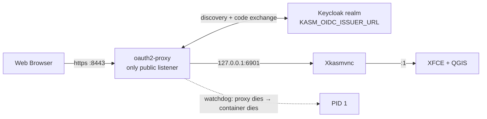

# Keycloak single sign-on

Corporate accounts, no passwords in the container. The desktop sits behind an
OIDC proxy that authenticates against Keycloak — or any other OIDC provider —
and only lets through users holding the right role. Uses
`KASM_AUTH_MODE=oidc`.

## Why this scenario

`basic` and `greeter` mode both keep credentials *inside* the container: a
password file, or Linux accounts materialised at boot. That does not scale past
a handful of people, and it means offboarding someone is a container restart
rather than a click in your directory.

With `oidc` the container holds no user credentials at all. Accounts, password
policy, MFA and group membership stay in the identity provider. Revoke someone
there and their next request to the desktop bounces.

## Topology



Three properties fall out of that shape:

- KasmVNC is bound to loopback. There is no published port for it, so an
  unauthenticated request cannot reach the desktop even to be refused by it.
- The proxy is the auth boundary and it is unprivileged (UID 1000, all
  capabilities cleared).
- If the proxy exits, PID 1 is signalled and the container stops — the desktop
  is never left serving without it.

## Requirements this covers

| Requirement | How |
|-------------|-----|
| Users authenticate with corporate credentials | OIDC authorization-code flow against the realm |
| No user passwords stored in the image | The container only holds a *client* secret |
| Only entitled staff may open the desktop | `KASM_OIDC_ALLOWED_ROLES` / `_GROUPS` |
| The client secret is not visible to `docker inspect` | `KASM_OIDC_CLIENT_SECRET_FILE` + a `0400` mount |
| The desktop cannot phone home | Egress lockdown on, with only the IdP allowlisted (automatically) |

## Run the demo

A complete, runnable version lives in
[`examples/keycloak-oidc/`](https://github.com/kartoza/qgis-desktop-docker/tree/main/examples/keycloak-oidc):
a throwaway Keycloak with a pre-imported realm plus the desktop wired to it.

```bash
nix run .#build-docker

# The browser and the container must reach the issuer under the same name.
echo '127.0.0.1 keycloak' | sudo tee -a /etc/hosts

nix run .#run-keycloak-demo
```

Open <http://keycloak:8443>.

| Who | Credentials | Outcome |
|-----|-------------|---------|
| alice | `alice` / `hunter2` | Has the `qgis-user` role → gets the desktop |
| mallory | `mallory` / `hunter2` | Authenticates, has no role → *Permission Denied* |
| admin | `admin` / `admin` | Keycloak console on <http://keycloak:8080/admin> |

Mallory is the interesting one: authentication and authorisation are separate
decisions, and the proxy enforces the second.

!!! warning "Demo credentials are public"
    The realm, its client secret and both passwords are committed to this
    repository. The demo realm is for seeing the flow work, never for
    protecting anything.

## Against your own Keycloak

Create a confidential client in your realm with standard flow enabled and a
valid redirect URI of `https://<your-host>/oauth2/callback`, then:

```bash
docker run --rm -p 8443:8443 --cap-add=NET_ADMIN \
  -e KASM_AUTH_MODE=oidc \
  -e KASM_OIDC_ISSUER_URL=https://sso.example.com/realms/gis \
  -e KASM_OIDC_CLIENT_ID=qgis-desktop \
  -e KASM_OIDC_CLIENT_SECRET_FILE=/run/secrets/oidc \
  -e KASM_OIDC_REDIRECT_URL=https://gis.example.com/oauth2/callback \
  -e KASM_OIDC_ALLOWED_ROLES=qgis-user \
  -e KASM_OIDC_COOKIE_SECRET_FILE=/run/secrets/cookie \
  -v /etc/qgis-desktop/client-secret:/run/secrets/oidc:ro \
  -v /etc/qgis-desktop/cookie-secret:/run/secrets/cookie:ro \
  ghcr.io/kartoza/qgis-desktop-docker:latest
```

Every variable is documented under
[Authentication → OIDC variables](../configuration/authentication.md#oidc-variables).

## Verification checklist

| Check | Expected |
|-------|----------|
| `curl -sI http://localhost:8443/` | `302` to the identity provider, never the desktop |
| `docker exec <c> ss -ltn` (or `/proc/net/tcp`) | `8443` on `0.0.0.0`, `6901` on `127.0.0.1` only |
| `docker inspect <c> \| grep -i secret` | Shows the *path*, never the value, when using `_FILE` |
| `docker exec <c> ls -l /run/kasm-oidc/secrets.cfg` | `-r-------- 1 user user` |
| Sign in as a user without the role | oauth2-proxy shows *Permission Denied* |
| `docker exec <c> curl https://example.com` | Blocked by the egress filter |
| `docker kill --signal=TERM $(pgrep -f oauth2-proxy)` inside the container | Container stops within ~5 s |

## Choosing between the modes

| | `basic` | `greeter` | `oidc` |
|-|---------|-----------|--------|
| Where accounts live | Container | Container | Identity provider |
| MFA | No | No | Whatever the IdP enforces |
| Per-user Linux session | No | Yes | With `KASM_OIDC_INNER_MODE=greeter` |
| Works offline | Yes | Yes | No — needs the IdP |
| Clean re-prompt on failure | No | Yes | Yes |

`oidc` and `greeter` compose: set `KASM_OIDC_INNER_MODE=greeter` to require SSO
at the edge *and* give each person their own home directory inside.
