# Kiosk display

QGIS on a screen someone walks up to: a wall display, a public terminal, a
workshop machine. It opens on your project by itself, there is no terminal,
nothing can be copied off it, and it can reach nothing on the network.



## Why this scenario

Everything else in this documentation is about giving someone a desktop. This
one is about giving them a *map* — and taking away everything that is not the
map, because the person in front of the screen is not necessarily someone you
know.

## What it enforces

| Requirement | How |
|-------------|-----|
| The map is on screen without anyone doing anything | `QGIS_DESKTOP_AUTOSTART_QGIS=1` with `--project` |
| No shell | `QGIS_DESKTOP_ALLOW_TERMINAL=0` deletes the terminal emulators and the command-runner dialogs |
| Nothing is copied off the screen | `KASM_ALLOW_CLIPBOARD_IN/OUT=0`, `KASM_ALLOW_PRIMARY_SELECTION=0` |
| A photograph of the screen is attributable | `KASM_WATERMARK_TEXT` |
| The machine reaches nothing | `QGIS_DESKTOP_EGRESS_ALLOW=` — empty, so everything outbound is dropped |
| A restart returns it to a known state | The project is mounted read-only; nothing on the desktop persists |

## Run it

```bash
nix run .#build-docker
nix run .#run-kiosk-scenario
```

Open <http://localhost:8443>. No login prompt: on a kiosk, whoever can reach
the URL is meant to see it — put the network boundary in front, or set
`QGIS_DESKTOP_AUTH_MODE=basic` if that is not true for you.

Replace `examples/kiosk/project/` with your own `.qgs` and its data; the
directory is mounted read-only at `/home/user/kiosk`.

## Verification checklist

| Test | Expected |
|------|----------|
| Open the URL and wait | QGIS appears with the project loaded, no interaction needed |
| Panel, applications menu, Ctrl-Alt-T, Thunar → *Open Terminal Here* | No launcher, no menu entry, nothing starts |
| Select text in QGIS and paste locally | Nothing on your clipboard |
| Look at the screen | Watermark with the date and time |
| `docker exec qgis-desktop-kiosk curl -m5 https://example.com` | Times out |
| Change something, then `docker compose restart` | Back to the original state |

## The caveat, stated plainly

!!! danger "This is not a sandbox"
    QGIS ships a Python console, and anything that can run Python can start a
    subprocess. Removing the terminal removes the *affordance* — the obvious
    route a curious person takes — not the capability.

    What actually contains someone determined: the desktop runs as an
    unprivileged UID, the egress filter drops everything the entrypoint did not
    allow before it dropped its own capabilities, and the whole thing is a
    container you can throw away and recreate.

    If the screen is somewhere genuinely hostile, put it on a network that
    cannot reach anything you care about, and treat the container as
    compromised by default.

## Variations

- **A dashboard that refreshes.** Add a QGIS plugin or a project with a
  refreshing layer; the container needs the layer's host in
  `QGIS_DESKTOP_EGRESS_ALLOW`.
- **A kiosk that remembers.** Add [home persistence](../configuration/persistence.md)
  and drop new projects into the bucket's `inbox/` prefix — the display picks
  them up without a redeploy.
- **A staffed terminal.** Set `QGIS_DESKTOP_AUTH_MODE=basic` or `oidc` so only
  your people can open it, and keep everything else.
