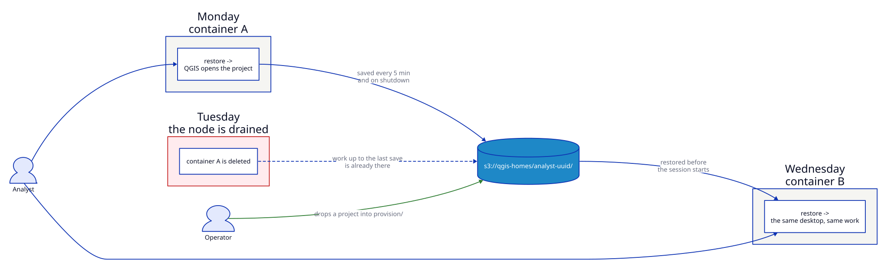

# Persistent workstation

A desktop the user treats as their own machine, running on infrastructure that
treats containers as disposable. Their projects, plugins and QGIS profile live
in object storage; the container is just the thing that happens to be running
today.



## Why this scenario

The desktop is stateless by default: delete the container and the user's work
goes with it. That is fine for a demo and useless for someone who opens the
same project every morning.

Mounting a volume solves it on one machine. This solves it anywhere — a
Kubernetes node drains, the pod comes back somewhere else, and the user cannot
tell.

## What it enforces

| Requirement | How |
|-------------|-----|
| Work survives the container being deleted | Home restored from the bucket at start, saved every interval and on shutdown |
| A hard kill costs a bounded amount | `QGIS_DESKTOP_PERSIST_INTERVAL` — 300s (five minutes) by default, set to 60s in this example |
| The user opens their map, not an empty canvas | A project seeded into `baseline/`, opened by `QGIS_DESKTOP_AUTOSTART_QGIS` |
| The operator can hand them files later | `deploy/`, delivered into the running session |
| Storage cannot grow without limit | `QGIS_DESKTOP_PERSIST_QUOTA`, enforced client-side |
| The user cannot reach the bucket themselves | Credentials root-only, scrubbed from the session environment |

## Run it

```bash
nix run .#build-docker
nix run .#run-persistence-demo
```

MinIO stands in for DigitalOcean, Hetzner or AWS; the container cannot tell the
difference.

| | |
|---|---|
| Desktop | <http://localhost:8443> — `user` / `password` |
| MinIO console | <http://localhost:9001> — `minioadmin` / `minioadmin123` |

QGIS opens on `~/projects/starter.qgs`, which was never in the image: the
compose file seeds it into the bucket's `baseline/` prefix, and the container
copies it into the home directory before the session starts.

## The daily cycle

1. **Start.** The lease is taken, `home/` is restored, `baseline/` is applied
   over the top without overwriting anything the user has edited, and `deploy/`
   is drained onto their desktop.
2. **Work.** Every interval the home directory is mirrored into `home/` — 300s by default, and 60s in this example so it is watchable.
   Replaced and deleted objects move to `.persist-trash/<timestamp>/`.
3. **Stop.** `SIGTERM` triggers a final save and releases the lease.

## Verification checklist

| Test | Expected |
|------|----------|
| Make a file, wait for `[persist] Saved`, then `docker kill qgis-desktop-persist` and start again | The file is back |
| Make a file and `docker compose stop` instead | Also back — the final save runs on `SIGTERM` |
| Upload a file to `.../deploy/` in the MinIO console | On the desktop within one interval (60s here); `deploy/` is empty afterwards |
| Delete `~/projects/starter.qgs`, restart the container | Back again: `baseline/` is applied at every start |
| Edit `starter.qgs`, wait for a save, restart | Your edit survives — the baseline never overwrites the user's copy |
| `docker exec -u 1000 qgis-desktop-persist cat /run/qgis-desktop/persist/rclone.conf` | Permission denied |
| Upload a file into `.../home/` directly | Gone at the next save, recoverable from `.persist-trash/` |

## In production

- **Give `/home/user` a real volume.** The sync is for surviving the *node*; a
  volume makes a restart on the same node instant and gives the quota something
  to mean.
- **One prefix per user**, `<username>-<uuid>`, in one bucket —
  [DigitalOcean](https://docs.digitalocean.com/products/spaces/details/limits/)
  and Hetzner both cap an account at 100 buckets.
- **Scope the credentials to the prefix**, server-side, ideally short-lived STS.
  The container does not enforce its own boundary and should not be trusted to.
- **Use a StatefulSet**, so a restarted pod keeps its name and reclaims its own
  lease instead of waiting for the TTL.
- **Set `terminationGracePeriodSeconds` above `QGIS_DESKTOP_PERSIST_FLUSH_TIMEOUT`**,
  or the final save is cut off.

Every variable, and the Kubernetes manifest,
is in [Home persistence](../configuration/persistence.md).
