# Single sign-on with persistent homes

The two headline features composed, which is how a real deployment uses them:
identity lives in your provider, state lives in object storage, and the
container in between holds nothing you would miss.



## Why this scenario

Separately, each feature answers half a question. Together they answer the
whole one: *how do I give a named person a desktop they can come back to,
without keeping any of it myself?*

- Accounts, MFA and offboarding stay in Keycloak. Revoke someone there and
  their next request bounces.
- Projects and settings stay in a bucket, under a prefix scoped to that person.
- The container is disposable. Kill it, redeploy it, move it to another node —
  the user notices nothing.

## What it enforces

| Requirement | How |
|-------------|-----|
| Only people in the directory can open it | OIDC authorization-code flow against the realm |
| Only *entitled* people can open it | `QGIS_DESKTOP_OIDC_ALLOWED_ROLES=qgis-user` |
| The desktop is unreachable without a session | KasmVNC bound to `127.0.0.1:6901`, no published port |
| Their work survives the container | Home restored at start, saved every interval and on shutdown |
| The user cannot reach the bucket | Credentials root-only, `0400`, scrubbed from the session environment |
| Neither identity nor state is in the image | Both are external; the container holds a client secret and an access key, and only as root |

## Run it

```bash
nix run .#build-docker

# once, so the browser and the container agree on the issuer's name
echo '127.0.0.1 keycloak' | sudo tee -a /etc/hosts

nix run .#run-sso-homes-scenario
```

Open **<http://keycloak:8443>**.

| Who | Credentials | Outcome |
|-----|-------------|---------|
| alice | `alice` / `hunter2` | Has `qgis-user` → signed in, home restored |
| mallory | `mallory` / `hunter2` | Authenticates, no role → *Permission Denied* |
| admin | `admin` / `admin` | Keycloak console at <http://keycloak:8080/admin> |
| — | `minioadmin` / `minioadmin123` | MinIO console at <http://localhost:9001> |

## Verification checklist

| Test | Expected |
|------|----------|
| `curl -sI http://keycloak:8443/` | `302` to Keycloak, never the desktop |
| Sign in as alice, make a file, wait for `[persist] Saved` | The file appears under `qgis-homes/alice-3d9f21c8/home/` in MinIO |
| `docker kill sso-homes-desktop`, then `docker compose up -d` | Sign in again — the file is there |
| Sign in as mallory | *Permission Denied* from the proxy, and no session |
| `docker exec -u 1000 sso-homes-desktop env \| grep -E 'SECRET\|ACCESS_KEY'` | Nothing — secrets are scrubbed before the desktop starts |
| `docker exec sso-homes-desktop ss -ltn` (or `/proc/net/tcp`) | `8443` on `0.0.0.0`, `6901` on `127.0.0.1` only |

## Scaling it up

This example runs **one** container for one prefix, which is the model the
persistence layer is designed for: one user, one container, one prefix.

For a team, run one per person — a StatefulSet per user, or a small controller
that starts a container on demand and points it at that user's prefix. Each one
gets:

- its own `QGIS_DESKTOP_PERSIST_PREFIX`, ideally `<username>-<uuid>`
- credentials scoped to that prefix server-side, ideally short-lived STS
- the same client and realm, since the proxy only decides *whether* to let
  someone in

If you would rather share one container between several people, set
`QGIS_DESKTOP_OIDC_INNER_MODE=greeter`: single sign-on stays at the edge, and
LightDM inside gives each person their own Linux session and home directory.
The trade-off is that they share one X display and one persistence prefix.

## See also

- [Authentication](../configuration/authentication.md) — every `QGIS_DESKTOP_OIDC_*` variable
- [Home persistence](../configuration/persistence.md) — the guards, the quota, the Kubernetes shape
- [Keycloak SSO](keycloak-sso.md) — the same identity setup without persistence
- [Persistent workstation](persistent-workstation.md) — the same persistence without SSO
