# Delivering data through the bucket

Someone needs a dataset in their session. They are in a locked-down desktop with
no terminal, and you would rather not `docker exec` into a running container or
restart it under them. So you put the file in their bucket, and it arrives.



## Two prefixes, two different jobs

Under each user's prefix the container reads three places, and treats them
differently on purpose.

| Prefix | When it arrives | Conflict with the user's copy | Afterwards |
|--------|-----------------|-------------------------------|------------|
| `baseline/` | Every container start | **User wins** — existing files are skipped | Stays in the bucket |
| `deploy/` | Every interval, while running | **Delivery wins** — existing files are overwritten | Deleted from the bucket |
| `home/` | Restored at start, saved back continuously | It *is* the user's copy | Stays |

The distinction matters more than it looks:

- `baseline/` is **standard issue** — a starter project, house styles, a
  basemap definition. It is idempotent, so it is safe to leave forever, and it
  never clobbers work. If a user edits the issued project, their version stands.
- `deploy/` is a **hand-off** — "here is the survey you asked for". It is
  delivered once and removed, so the user isn't handed the same file every
  minute, and a stale copy can't reappear after they delete it.

Getting this backwards is the common mistake: putting a one-off delivery in
`baseline/` means the user can never get rid of it, and putting a baseline in
`deploy/` means it lands on their Desktop once and is gone from the bucket.

!!! danger "Never upload into `home/`"
    `home/` is a **mirror**, and it only travels container → bucket. Putting a
    file there does not give it to the user — and because a file that exists in
    the bucket but not in the container looks exactly like one the user deleted,
    the next save removes it again (into `.persist-trash/`, recoverable, but
    gone).

    This is the mistake everyone makes once. Upload to `deploy/` instead.

### What happens after you upload



```text
1. you upload            s3://…/surveyor-7c1e/deploy/parcels.gpkg
2. next sync tick        copied into ~/Desktop/parcels.gpkg, owned by the user
3. immediately after     deleted from deploy/  ← delivered once, never again
4. next save             mirrored back as home/Desktop/parcels.gpkg
```

Step 4 is the part worth understanding: once delivered, the file is simply one
of the user's own files, so the ordinary mirror keeps it safe. `deploy/` is a
letterbox, not storage — it is empty again the moment the hand-off is done.

If the container is offline, or the copy fails, nothing is deleted: the file
waits in `deploy/` and is delivered when the container next runs.

## Run it

```bash
nix run .#build-docker
nix run .#run-data-drop-scenario
```

Open **<http://localhost:8443>** (`user` / `password`). QGIS opens on the
baseline project. About a minute later a dispatcher drops `assets.csv` into
`deploy/` and it appears on the desktop — the scenario includes that second step
so you can watch a delivery land on a session that is already running.

MinIO's console is at <http://localhost:9001> (`minioadmin` / `minioadmin123`);
browse `qgis-homes/surveyor-7c1e/` to see the three prefixes side by side.

## Delivering to a real user

Any S3 client works, because the container is only reading a prefix.

**From a bucket browser** — the MinIO console, S3 Browser, the AWS console:

1. Open the bucket and go to the user's prefix, e.g. `qgis-homes/surveyor-7c1e/`
2. Open **`deploy/`** — it is already there, created when the container first
   started
3. **Upload** the file

Within one interval it appears on their desktop, owned by them, and `deploy/`
empties itself. Nothing restarts, and nobody has to touch the container.

**From the command line:**

```bash
# a baseline for everyone on the team
for user in surveyor-7c1e analyst-3f88 gis-lead-a201; do
  aws s3 cp --recursive ./kit/ "s3://qgis-homes/${user}/baseline/"
done

# a one-off, to one person, right now
aws s3 cp ./ward-7-parcels.gpkg s3://qgis-homes/surveyor-7c1e/deploy/
```

Nothing needs to restart. The next interval picks it up.

### Why `deploy/` is already there and `baseline/` is not

S3 has no directories — a prefix exists only while an object sits under it — so
a freshly created home would show nothing but `home/`, and anyone wanting to
send a file would have to know the name and hand-create the path.

The container therefore creates `deploy/` at every start, as a zero-byte
directory marker. rclone skips markers when listing, so an empty `deploy/` is
still nothing to deliver, and the prefix survives a delivery that empties it.

`baseline/` is not created, because the two are used at different moments.
`deploy/` is where somebody drops a file in reaction to a request — it has to be
waiting for them. `baseline/` is set up once when a deployment is designed, by
whoever is already scripting the bucket, and an empty one on every home would
imply an action nobody needs to take. It appears when you put something in it.

`QGIS_DESKTOP_PERSIST_CREATE_DEPLOY=0` stops `deploy/` being created — worth
doing only if the container's credential is scoped so tightly that it may not
write outside `home/`.

## What stops this being an attack surface

Delivery writes into a home directory on behalf of a user who never sees the
credentials. Three things keep that honest:



| Concern | What happens |
|---------|--------------|
| Files land as root and the user can't touch them | The staging copy drops to uid 1000 via `setpriv`, so everything delivered is owned by the user |
| A crafted path escapes the home directory | The copy runs unprivileged and rclone writes into a staging directory first — a `../` in an object key cannot land outside `$HOME` |
| The staging directory leaks the operator's files | It is created `0755` root-owned, with the config-writing `umask 077` scoped to a subshell so it can't leak — there is a regression test for exactly this |
| The user reads the credentials to fetch other prefixes | They are root-owned `0400` and scrubbed from the environment before the desktop starts |
| A delivery fills the disk | It counts against `QGIS_DESKTOP_PERSIST_QUOTA` like anything else |

## Verification checklist

| Test | Expected |
|------|----------|
| `docker logs data-drop-desktop \| grep Baseline: applying` | `Baseline: applying 3 file(s) from baseline/` at start |
| Edit `~/projects/survey.qgs`, restart the container | Your edit survives — the baseline skips existing files |
| `mc cp x.gpkg demo/qgis-homes/surveyor-7c1e/deploy/` | Appears in `~/Desktop` within one interval, and disappears from `deploy/` |
| `ls -l ~/Desktop/assets.csv` on the desktop | Owned by `user`, not `root` |
| `docker exec -u 1000 data-drop-desktop env \| grep KEY` | Nothing |

## Turning it off

Both paths are on by default. Either can be disabled independently:

```bash
QGIS_DESKTOP_PERSIST_BASELINE=0     # no baseline
QGIS_DESKTOP_PERSIST_DEPLOY=0         # no mid-session delivery
QGIS_DESKTOP_PERSIST_DEPLOY_DEST=Downloads   # default: Desktop
```

## See also

- [Home persistence](../configuration/persistence.md) — the sync itself, the guards, the quota
- [Persistent workstation](persistent-workstation.md) — the same storage, one user, no delivery
- [SSO + persistent homes](sso-persistent-homes.md) — delivering to people who sign in with SSO
