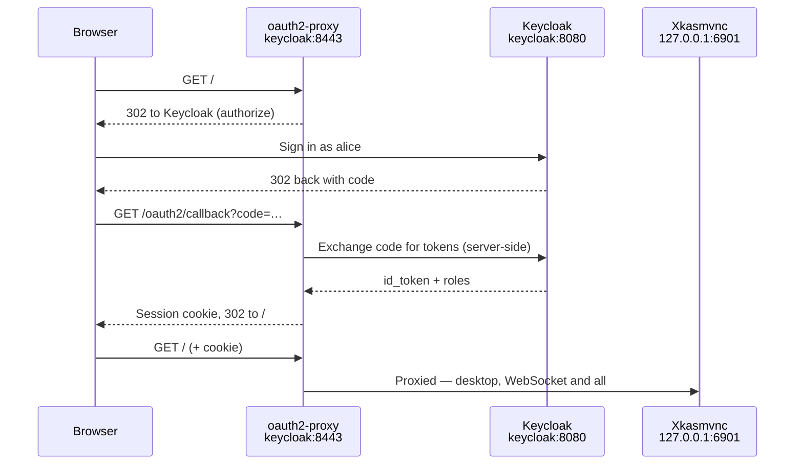

<!--
SPDX-FileCopyrightText: Kartoza
SPDX-License-Identifier: GPL-2.0-or-later
-->

# Keycloak single sign-on demo

A throwaway Keycloak with a pre-imported realm, and the QGIS desktop behind an
OIDC proxy that trusts it. Everything needed to see `KASM_AUTH_MODE=oidc` work
end to end, including a user who is *refused* entry.

!!! danger "Demo only"
    The realm, its client secret and both passwords are committed to this
    repository in plain sight. Never point anything real at this realm, and
    never reuse `client-secret.txt`.

## Run it

```bash
# 1. Build the image (once)
nix run .#build-docker

# 2. Teach your browser's machine where "keycloak" lives (once)
echo '127.0.0.1 keycloak' | sudo tee -a /etc/hosts

# 3. Start both containers
nix run .#run-keycloak-demo
#    …or, equivalently:
#    docker compose -f examples/keycloak-oidc/docker-compose.yml up
```

Then open **<http://keycloak:8443>**.

| Who | Credentials | What happens |
|-----|-------------|--------------|
| alice | `alice` / `hunter2` | Holds the `qgis-user` role → lands on the QGIS desktop. |
| mallory | `mallory` / `hunter2` | Authenticates fine, has no role → oauth2-proxy shows *Permission Denied*. |
| admin | `admin` / `admin` | Keycloak admin console at <http://keycloak:8080/admin>. |

That second row is the point of the demo: authentication and authorisation are
separate decisions, and the proxy enforces the second one via
`KASM_OIDC_ALLOWED_ROLES=qgis-user`.

## Why the hosts entry

The `iss` claim Keycloak puts in the token is the issuer URL *as Keycloak knows
itself*. oauth2-proxy rejects a token whose issuer is not the one it was
configured with — so the browser and the desktop container have to reach
Keycloak under one and the same name.

- Inside the compose network, `keycloak` resolves to the Keycloak container.
- On your machine, the hosts entry makes `keycloak` resolve to `127.0.0.1`,
  where both published ports live — 8080 for Keycloak, 8443 for the desktop.

Hence the slightly odd-looking desktop URL, `http://keycloak:8443`.



## What to try next

**Group-based access instead of roles.** The realm also ships a `/gis-users`
group and a `groups` claim mapper. Swap the role filter in the compose file for:

```yaml
- KASM_OIDC_ALLOWED_GROUPS=/gis-users
```

**Per-user Linux sessions behind SSO.** Set `KASM_OIDC_INNER_MODE=greeter` and
the desktop puts a LightDM login inside the SSO-protected session, so each user
gets their own home directory.

**Watch the egress lockdown.** `KASM_EGRESS_ALLOW` is left empty, yet SSO still
works — the entrypoint adds the issuer's host to the nftables allowlist by
itself. Open a terminal on the desktop and `curl https://example.com` will
still hang, as it should.

The full write-up — topology, how to point this at your own Keycloak, and a
verification checklist — is in the docs under
[Scenarios → Keycloak SSO](../../docs/scenarios/keycloak-sso.md), and every
variable is listed under
[Configuration → Authentication](../../docs/configuration/authentication.md).

## Tear down

`Ctrl-C` if you started it with `nix run .#run-keycloak-demo` (it cleans up on
exit). Otherwise:

```bash
docker compose -f examples/keycloak-oidc/docker-compose.yml down -v
```

Remember to remove the hosts entry when you are done with the demo.

---

Made with 💗 by [Kartoza](https://kartoza.com) ·
[Donate!](https://github.com/sponsors/kartoza) ·
[GitHub](https://github.com/kartoza/qgis-desktop-docker)
